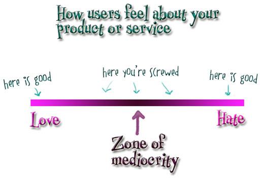

I first heard about [Kathy Sierra](https://web.archive.org/web/20250715161449/http://headrush.typepad.com/about.html) in a post on Loud Thinking, David Hansson's blog. Kathy also spoke at RailsConf Europe in September. She and a few friends write at [Creating Passionate Users](https://web.archive.org/web/20250715161501/https://headrush.typepad.com/creating_passionate_users/).

She's deeply interested in the brain, artificial intelligence, psychology, and philosophy. Her articles show a different angle on things we should already know. [This post](https://web.archive.org/web/20250915181120/https://headrush.typepad.com/creating_passionate_users/2006/10/dilbert_and_the.html) is an excellent example. Here's the translation:

#### Dilbert and the Zone of Mediocrity

<small>Caption. [title] "How users feel about your product or service".  [arrows] "here is good", "here you're screwed", "here is good".  [bar] "Love", "Zone of Mediocrity", "Hate".</small>

How brave are you? How far will you (or your employer) go to avoid the Zone of Mediocrity? Until or unless you're willing to risk passionate hate, you may never feel the love. Scott Adams agrees. In a [recent post on the Dilbert blog](https://web.archive.org/web/20070101214718/http://dilbertblog.typepad.com/the_dilbert_blog/2006/10/knowing_when_to.html), he wrote:

> "If everyone exposed to a product likes it, the product will not succeed... The reason that a product 'everyone likes' will fail is because no one 'loves' it. The only thing that predicts success is passion, even if only 10% of the consumers have it."

This is NOT about being _remarkable_. It's about being _lovable_. And that almost always means being _hated_ as well. Our Head First Java book, for example, has 139 Amazon reviews, and most are either five stars ("love it, best technical book ever, I learned a lot") or one star ("hated it, worst technical book ever, authors should be shot").

But crafting a book that people would either love or hate was not our intention. We set out to make a more brain-friendly learning book format, and we were just clueless and naive enough to not realize how many implicit "rules" we were violating. It wasn't until O'Reilly editors started a mini revolt against it that we knew we'd crossed a Line That Shall Not Be Crossed and created something potentially _embarrassing_.

Today, it is often far more risky to create something "safe" than to take a big frickin' chance on something deeply provocative, dangerously innovative, or just plain weird.

Think about all the things you love today that once seemed very, very weird. Things that someone took a huge frickin' chance on.

#### Today, the more you try to _prevent_ failure, the more likely you are to fail

That wasn't always true, but geez... how many more [whatevers] do we need today? There are way too many of all the things we _already have_ and not enough introductions of things we _don't_ have. We all know the reasons why companies play it safe, and why employees are often forced to play it safe, but this me-tooism isn't helping anyone.

#### What does it take to move out of the Zone of Mediocrity?

Normally at this point I'd talk about the usual things everyone talks about... [how to come up with breakthrough ideas](https://web.archive.org/web/20250828051214/http://headrush.typepad.com/creating_passionate_users/2005/11/how_to_come_up_.html), where to look for opportunities, being innovative, blah blah blah. You know all that. I think it really comes down to this:

#### To avoid the Zone of Mediocrity, you must suspend disbelief

You must be willing and able to turn off (temporarily) The Voice inside that says, "We'll never get away with this. People will hate it." That doesn't necessarily mean The Voice is _wrong_, but until you can shut it off, you're virtually guaranteed to stay with safer, incremental ideas. But remember: "safer" really _isn't_ safer anymore, unless you're looking only to avoid criticism. Safe will keep you safely out of the spotlight. If that's what you want (and sometimes that's the best approach), then fine. But if not...

(side note: this is somewhat like The Inner Game approach or Drawing on the Right Side of the Brain or any of the other approaches to creativity that get your logical "talking" mind out of the way, so all the more useful but non-speaking parts of your brain can get on with the important things you're trying to accomplish.)

And it's not just suspending disbelief about what users (or critics) will say... you must also suspend disbelief about what your company will let you do. I first experienced this at Sun, where it was almost impossible to creatively brainstorm about ways to improve things without someone jumping in with, "Yeah, but they'd never let us do that." End of discussion. End of chance to do something amazing.

Every time I do an internal workshop, the participants are far more negative than when some of those same people are in a public version of my passionate users workshop. By taking them outside their company and having them brainstorm or work on fictional or other people's projects, their minds are free to move about. I've nearly quit doing in-house workshops because the "they'll never let us do that" syndrome is so strong.

You can't help users kick ass until your employer lets YOU kick ass. Easy for the unemployed ME to say ; )
