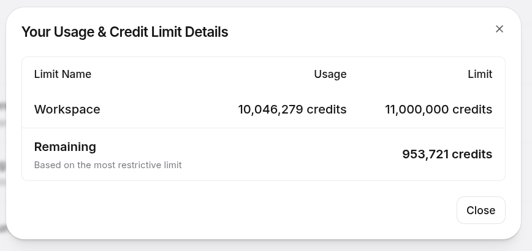

**TL;DR — Escuta isso e continua lendo:**

<audio controls preload="metadata" style="width: 100%; max-width: 640px;">
  <source src="https://makita-news.s3.amazonaws.com/podcasts/episodes/2026-04-06.mp3" type="audio/mpeg">
  Seu navegador não suporta o elemento de áudio. <a href="https://makita-news.s3.amazonaws.com/podcasts/episodes/2026-04-06.mp3">Baixar o mp3 aqui.</a>
</audio>

Esse é o episódio do dia 6 de abril do podcast do [The M.Akita Chronicles](/tags/themakitachronicles), já gerado com a nova pipeline da ElevenLabs v3. Assina o canal no [Spotify](https://open.spotify.com/show/7MzG2UB7IAkC3GAwEXEIVD) pra não perder episódio novo desses.

---

Quando o Qwen3 TTS foi lançado, pelos idos de janeiro desse ano, todo mundo no Twitter/X e nas newsletters de IA gritou "ElevenLabs killer". Tem [artigo no Medium](https://medium.com/@warpie/qwen3-tts-is-the-first-real-open-source-threat-to-elevenlabs-56ba200ab5ee) dizendo que é a primeira ameaça open source real à ElevenLabs. Tem [post da byteiota](https://byteiota.com/qwen3-tts-3-second-voice-cloning-beats-elevenlabs/) dizendo que a clonagem de voz em 3 segundos bate a ElevenLabs. Tem [análise no Analytics Vidhya](https://www.analyticsvidhya.com/blog/2025/12/qwen3-tts-flash-review/) falando que é o TTS open source mais realista já lançado. O consenso da internet entusiasta era: finalmente temos open source que faz frente à ElevenLabs, o jogo virou, é só questão de tempo.

Eu resolvi testar no meu próprio fluxo de produção, como de costume. Montei um pipeline inteiro em cima do Qwen3 TTS 1.7B pra gerar o podcast semanal do [The M.Akita Chronicles](/tags/themakitachronicles), e documentei os bastidores no [post sobre servir IA na nuvem](/2026/02/18/servindo-ia-na-nuvem-meu-tts-pessoal-bastidores-do-the-m-akita-chronicles/). Quem quiser ver o detalhe de tempo de partida a frio, clonagem de voz, parâmetros de sampling que mudam de um modo pro outro, dá uma olhada nesse link que eu não vou repetir tudo aqui.

A pergunta desse post é diferente. Depois de quase dois meses rodando essa configuração em produção, com episódio indo ao ar toda segunda-feira, ontem à noite eu finalmente desliguei o Qwen3 e passei tudo pra ElevenLabs v3. Vou contar por quê.

## O que não funcionou no Qwen3

Entre 15 de fevereiro e 30 de março eu fiz dezenas de commits ajustando o fluxo do podcast: prompts, parâmetros de sampling, ordem de geração, silêncios de referência na amostra de clone de voz, normalização de volume, pronúncia de siglas técnicas. Corrigir a voz do Marvin que cortava a primeira sílaba porque o áudio de referência começava sem silêncio inicial. Afinar a voz do Akita pra ela soar mais confiante e assertiva. Adicionar crossfade entre jingles de seção. Resolver a pronúncia errada de "podcast" pra ela não sair como "pódcast". Mandar o gerador de roteiro preferir português a anglicismo gratuito pro TTS não engasgar. Cada um desses ajustes foi uma sessão de horas escutando áudio, gerando de novo, ajustando parâmetro.

O resultado ficou aceitável. "Aceitável" no sentido de que eu consegui publicar todo episódio sem ter que regravar nada à mão. Mas escutando com atenção, a voz do Qwen3 tem aquele jeito inconfundível de IA gerando áudio. Intonação meio morta, ritmo uniforme. Em trechos longos, você sente que é máquina falando. Serve pra ir pro ar, mas tá a quilômetros do que você escuta num podcast profissional feito por gente.

O problema pior foi a pronúncia em inglês. Meu podcast cobre notícias de tecnologia, então termos como "MCP", "RAG", "Claude Opus", "GPT-5", "open source" aparecem em toda conversa. O Qwen3 pegava esses termos e pronunciava eles com sotaque brasileiro, tipo "ó-péne-ssourssê", coisa assim. Ficava ilegível pro ouvinte. A solução que eu tive que implementar foi mapear manualmente no prompt do LLM que gera o roteiro quais palavras em inglês trocar por equivalente em português. O prompt hoje tem uma seção inteira dividida entre "manter em inglês" (nomes próprios, marcas, termos já incorporados ao brasileiro) e "traduzir pro português" (anglicismo gratuito), mais ou menos assim:

```markdown
**REPLACE with Portuguese** (common English words that have natural
Brazilian Portuguese equivalents):
- "update" → "atualização"
- "release" → "lançamento"
- "feature" → "recurso/funcionalidade"
- "deploy" → "implantação" or just "colocar em produção"
- "trade-off" → "dilema" or "escolha"
- "performance" → "desempenho"
- "default" → "padrão"
- "insight" → "percepção/sacada"
- "skills" → "habilidades"
- "approach" → "abordagem"
- "highlights" → "destaques"
```

Chamam isso aqui em casa de "limpar anglicismo pra o TTS não engasgar". Engraçado porque eu não queria esse nível de restrição no meu roteiro. Queria que a voz simplesmente pronunciasse "update" quando o contexto natural fosse "update". Como o modelo não consegue, tive que mutilar o vocabulário do podcast pra o resultado final ficar escutável. É uma solução paliativa, daquelas que você adiciona torcendo pra poder remover depois quando a tecnologia amadurecer.

## A experiência com a ElevenLabs v3

Ontem à tarde abri uma conta na ElevenLabs, comprei o plano Pro (US$99/mês), e comecei a experimentar com o modelo `eleven_v3`, que saiu em fevereiro desse ano. Trinta minutos depois eu tinha uma prova de conceito rodando, e umas duas horas depois o sistema inteiro do podcast migrou. A diferença de esforço é abissal.

Os detalhes técnicos da migração ficaram documentados num doc interno do projeto, então vou resumir aqui o quadro comparativo que importa:

| Dimensão | Qwen3 TTS 1.7B (antigo) | ElevenLabs `eleven_v3` (atual) |
|---|---|---|
| Qualidade (Akita) | Boa, clone de áudio real | Melhor, mesmo clone mas prosódia mais natural |
| Emoção inline no roteiro | Não suporta | `[sighs]`, `[sarcastically]`, `[excited]`, `[laughs]`, funciona em pt-BR |
| Tempo de partida a frio | 5 a 15 min subindo GPU na RunPod antes de cada rodagem | Zero, chamada HTTPS com resposta imediata |
| Vazão | ~1× do tempo real (serializado) | ~6× do tempo real com concorrência 4 |
| Tempo total pra um episódio de 28 min | ~25 a 30 min | **~4 min** |
| Superfície operacional | RunPod, Docker, FastAPI, pesos do Qwen, conta de GPU | Uma variável de ambiente (`ELEVENLABS_API_KEY`) |
| Custo por episódio | ~$0.08 de GPU | ~$2.70 em créditos ElevenLabs |

Repara no último ponto. O Qwen3 custa menos de dez centavos de dólar por episódio. A ElevenLabs custa quase trinta vezes mais. E mesmo assim vale a pena. Os outros pontos do quadro resolvem problemas que sugavam horas da minha semana. Eu não preciso mais escrever código pra escalar GPU na nuvem, não preciso esperar a máquina ligar toda vez, não preciso ficar de babá do modelo nem reconstruir a imagem Docker quando o peso muda. A operação virou uma linha de configuração.

E o mais interessante: as tags de emoção no meio do texto. O modelo v3 aceita marcadores tipo `[sighs]`, `[sarcastically]`, `[dryly]`, `[excited]`, e muda a entonação de acordo. Isso funciona em mais de 70 idiomas, incluindo português do Brasil. Isso transformou a geração do roteiro porque agora eu posso pedir ao LLM que monta o roteiro pra colocar tags emocionais nos momentos certos, o que dá uma vivacidade que o Qwen3 não conseguia entregar nem de longe. Um exemplo concreto do que sai no roteiro depois:

```
AKITA: Isso é simples. [dismissive] Quem ainda acredita que Bitcoin
vai morrer não tá prestando atenção.
MARVIN: [sighs] Mais uma semana, mais uma leva de devs confiando
cegamente em pacotes npm. Previsível.
```

Eu tenho até duas paletas separadas de tags, uma pro Akita (expressivo mas controlado, usa `[excited]`, `[dismissive]`, `[emphatic]`) e outra pro Marvin (estóico, só `[sighs]`, `[sarcastically]`, `[tired]`, `[dryly]`). Isso tá tudo codificado nos prompts de geração do roteiro pro LLM saber que personagem pode usar o quê.

## Sobre a voz do Marvin

Pros ouvintes que já se acostumaram com a voz do Marvin, fica tranquilo: eu fiz o clone dele na ElevenLabs usando a mesma amostra de áudio que eu já tinha usado pra treinar no Qwen3. É a mesma voz. Só que agora ela soa ainda melhor, porque o modelo da ElevenLabs captura nuance e prosódia que o Qwen3 não conseguia entregar.

## Escuta aí e me conta

Pra provar que o papo é real, aqui tá o episódio de segunda-feira, dia 6 de abril, já gerado com a nova pipeline:

<audio controls preload="metadata" style="width: 100%; max-width: 640px;">
  <source src="https://makita-news.s3.amazonaws.com/podcasts/episodes/2026-04-06.mp3" type="audio/mpeg">
  Seu navegador não suporta o elemento de áudio. <a href="https://makita-news.s3.amazonaws.com/podcasts/episodes/2026-04-06.mp3">Baixar o mp3 aqui.</a>
</audio>

Se você já é ouvinte do podcast no [Spotify](https://open.spotify.com/show/7MzG2UB7IAkC3GAwEXEIVD) e escutou os episódios anteriores feitos com Qwen3, compara e me diz nos comentários se você nota a diferença ou se pra você tanto faz. Eu tô curioso de saber quanto é percepção treinada minha escutando horas de áudio de TTS e quanto é diferença óbvia pra ouvinte casual.

A partir da próxima semana, todos os episódios do podcast serão gerados pela ElevenLabs v3. A newsletter já tá ligada na nova pipeline, os jobs agendados de pré-aquecer a GPU na RunPod foram desativados, e o código legado do Qwen3 fica no repositório como plano B caso um dia o v3 dê problema crônico. Em duas edições de arquivo eu volto pra ele. Provavelmente nunca vou ter que voltar.

## A parte de dublar os vídeos do YouTube

Agora o gancho pra segunda metade desse post. No [artigo de aniversário que eu publiquei mais cedo hoje](/2026/04/09/20-anos-de-blog-o-ano-em-que-a-ia-finalmente-me-deixou-traduzir-tudo/), contei que o Claude Code traduziu quase metade do meu blog pra inglês num fim de semana. No mesmo espírito, fui atrás de dublar os vídeos do canal [Akitando](https://www.youtube.com/@Akitando).

O canal tem 146 episódios, algo como 96 horas de conteúdo técnico em português, e mais de 500 mil inscritos. Eu já tinha as legendas traduzidas (um `.srt` curado por episódio), e o YouTube até oferece dublagem automática em inglês. Mas o resultado é tipo Google Translate de 2015: entende, passa a ideia, mas ninguém quer ouvir por muito tempo.

Testei as três abordagens de voz da ElevenLabs e só uma servia. Speech-to-Speech converte voz mas não traduz. A API de Dubbing traduz mas cria a voz sozinha, sem deixar forçar um clone específico. Só a Text-to-Speech resolvia: pegar meu `.srt` em inglês, mandar cada bloco pro endpoint TTS com a minha voz clonada, e montar o áudio alinhado com o vídeo original.

Só que ter o `.srt` traduzido não basta. Tradução crua de legenda não sobrevive ao TTS. Trechos com código-fonte, URLs, hashes hexadecimais, listas de comandos shell — o modelo entra em modo soletrar e o áudio sai com o dobro da duração esperada. Traduções longas demais estouram a janela de tempo e precisam ser condensadas pra a voz não ficar atropelada. SRTs truncadas precisam ser completadas. E a cada correção, rodar a pipeline de novo, escutar, achar o próximo problema, corrigir, repetir. O processo inteiro foi um ciclo de interrupções, correções manuais e re-runs — longe do "aperta o botão e sai dublado" que a gente imagina antes de meter a mão.

O grande desafio era o sotaque. Minha voz clonada foi treinada em português brasileiro, então quando tenta falar inglês o sotaque puxado aparece. A ElevenLabs tem a tag `[American accent]` que funciona em v3, mas em cima de uma voz treinada em outra língua ela é fraca — o sotaque brasileiro ainda saía por baixo. A saída foi treinar uma segunda voz minha, só em inglês. Gravei uns minutos no meu melhor sotaque americano, subi como Instant Voice Clone separado na minha conta, batizei de "Akita English", e configurei o pipeline pra usar essa voz por padrão. O resultado sai mais natural, sem precisar de tag nenhuma, e a identidade de voz continua sendo a minha.

### O teto honesto de qualidade da minha voz em inglês

Vamos ser francos. Eu sou brasileiro falando inglês, não sou nativo, e não tenho tempo nem paciência pra treinar pronúncia por horas. O clone só consegue ser tão bom quanto a amostra original — se a amostra é um não-nativo lendo um roteiro, o clone herda as imperfeições. Nenhum clone vai me fazer soar como "Fabio falando inglês perfeito", porque esse som não existe pra o modelo imitar.

Pra chegar na versão que tá rodando, gravei cinco amostras de treino diferentes ao longo do dia, cada uma com ritmo e roteiro diferentes, e rodei um A/B ao vivo comparando com o original em português. Nenhuma soou como nativo, e nunca foi esse o objetivo. A meta realista era mais modesta: soar reconhecivelmente como eu, ler conteúdo técnico sem tropeçar, e aguentar um episódio inteiro sem cansar o ouvinte. O vencedor acabou sendo a primeira iteração, a "Akita English" original. Longe de perfeito, mas suficiente pra colocar no ar. Trocar no futuro é literalmente uma linha no arquivo de configuração.

O que mais me surpreendeu no caminho foi perceber que o ritmo da amostra importa mais que o timbre. O clone aprende a cadência de quem gravou: a iteração 5 ficou 25% mais lenta que a iteração 2 lendo exatamente o mesmo texto, só porque eu gravei aquela amostra mais devagar. Pra dublagem de vídeo tech, o alvo certo é ritmo de explicação de YouTube, vivo, uns 150 palavras por minuto. Nada de ritmo de audiobook.

### Como eu alinho o áudio com o vídeo original

Um ponto não óbvio: texto em inglês tende a ser mais longo ao falar do que o português equivalente. Se você simplesmente gera o áudio de cada legenda e cola no tempo original, o dub vai se acumulando. Com 30 minutos de vídeo, você já tá vários segundos fora de sincronismo.

Minha abordagem foi atacar o problema em camadas. A primeira versão dividia o SRT em blocos menores, chamados de "chunks". Cada chunk tinha no máximo 700 caracteres (pra v3 não alucinar) e só podia cortar em fim de frase, nunca no meio. Um algoritmo simples acumulava legendas num buffer até chegar perto do teto, depois voltava procurando a última legenda do buffer que terminava com ponto, exclamação ou interrogação, e fazia flush só até ali. O resto das legendas já acumuladas ficava pra compor o próximo chunk. Cada chunk guardava o timestamp de início e fim das legendas que cobria, pra a montagem saber exatamente onde posicionar aquele pedaço de áudio depois.

```python
# Pra cada nova legenda que chega, checa se adicionar ela
# estouraria o limite do chunk atual.
for cue in cues:
    projected = buffer_char_len(buf) + len(cue.text)
    if projected > max_chars and buf:
        # Procura a última legenda do buffer que termina
        # com pontuação final ('.', '!', '?', '…').
        sentence_end = last_sentence_end_index(buf)
        if sentence_end is not None:
            buf = flush(buf, sentence_end, chunks)
        else:
            # Run-on maior que max_chars sem fim de frase.
            # Raro, mas acontece. Avisa e corta mesmo assim.
            log.warning("run-on sentence > %d chars — "
                        "splitting mid-sentence as a last resort",
                        max_chars)
            buf = flush(buf, len(buf), chunks)
    buf.append(cue)

    # Soft-break: se o buffer já tá pelo menos 60% cheio E
    # a legenda atual terminou uma frase, esvazia agora.
    # Mantém os chunks balanceados em torno de 60 a 100% do max.
    if cue.ends_sentence and buffer_char_len(buf) >= max_chars * 0.6:
        buf = flush(buf, len(buf), chunks)
```

Tecnicamente, esse foi o ponto de virada: em vez de deixar a estrutura da dublagem seguir a estrutura visual da legenda, o chunker passou a seguir a estrutura real dos parágrafos do roteiro. Não vou repetir aqui toda a novela de como cheguei nisso e por que isso acabou forçando rerender em massa, porque volto nessa história mais abaixo, na parte dos problemas que só apareceram depois do primeiro upload. O ponto técnico aqui é simples: quando a janela passou a representar um parágrafo falado de verdade, o áudio começou a soar natural e o alvo de stretch pôde subir de 92% pra 95%.

Feito isso, ainda sobra o problema do inglês ser mais longo ao falar que o português equivalente. Aqui a sacada é prever se um chunk vai estourar a janela alvo **antes** de gerar o áudio. Se a razão `caracteres / 16 caracteres-por-segundo` já passa da duração alvo com uma margem, a pipeline manda o parâmetro `speed` direto pra API da ElevenLabs, pedindo pro modelo gerar o áudio nativamente mais rápido. Isso preserva a prosódia muito melhor do que comprimir depois. O teto é 1.15× (acima disso a voz começa a soar atropelada).

```python
# antes de chamar a API, prevê se vai estourar
expected_sec = char_count / EXPECTED_CHARS_PER_SEC  # 16 chars/s
predicted_ratio = expected_sec / target_sec

voice_speed = 1.0
if predicted_ratio > PREEMPTIVE_SPEED_THRESHOLD:   # 1.05
    voice_speed = min(predicted_ratio * 0.98,
                      PREEMPTIVE_SPEED_MAX)         # cap em 1.15
    voice_settings["speed"] = voice_speed
```

Mesmo com o `speed` preventivo ligado, às vezes o áudio gerado ainda fica um pouquinho mais longo do que a janela alvo. Pra isso existe uma segunda rede de proteção: medir o áudio real com `ffprobe` depois de gerado, comparar com a janela alvo, e aplicar o filtro `atempo` do `ffmpeg` pra comprimir no pós-processo se passou de 2% de tolerância, com teto de 1.20×. A combinação do `speed` nativo (1.15×) com o `atempo` (1.20×) dá uma compressão efetiva de até 1.38×, suficiente pra caber naturalmente mesmo nos casos mais extremos sem quebrar qualidade.

```python
# depois de gerar o chunk
actual = ffprobe_duration(chunk_path)
ratio = actual / target_sec

if ratio > FIT_TOLERANCE:       # 1.02
    # comprime o áudio sem mexer no pitch
    ffmpeg_atempo = min(ratio, FIT_MAX_ATEMPO)   # 1.20
    apply_atempo(chunk_path, ffmpeg_atempo)
```

Quando um chunk gerado fica mais curto que a janela alvo, o pipeline estende o áudio levemente (sem afetar pitch) pra reduzir o silêncio feio depois que ele termina. O objetivo não é preencher a janela inteira, uma pausa natural entre frases é boa, mas suavizar os casos mais gritantes de silêncio que dariam a impressão de "áudio cortado".

Num episódio grande, 95 minutos, 194 chunks, o desvio cumulativo total ficou em -0,7%. Uns 43 segundos de drift ao longo do episódio inteiro, imperceptível enquanto você assiste.

O que salvou o orçamento nessa arquitetura é que cada chunk fica salvo individualmente no disco como um `.mp3` separado. A pipeline mantém um manifesto com o texto normalizado de cada chunk, e antes de chamar a API da ElevenLabs, compara o texto atual com o cache. Se o texto não mudou, reutiliza o áudio já gerado sem gastar crédito nenhum. Se eu reescrevo uma cue problemática, só os chunks afetados por aquela cue são regenerados — o resto do episódio fica intacto.

Isso é o que viabilizou as iterações. Eu rodava o batch, escutava trechos, identificava um problema (tradução longa demais, snippet de código que o TTS não conseguia pronunciar, chunking que cortou num ponto ruim), corrigia o SRT ou ajustava os parâmetros do chunker, e rodava de novo. Cada re-run consumia uma fração dos créditos e do tempo do run original, porque só os chunks alterados eram regenerados. Sem esse cache, cada iteração teria custado quase o mesmo que a primeira rodada, e o custo total do batch teria sido duas ou três vezes maior.

Essa mudança de chunking também teve impacto pesado no cache e no custo, mas deixo essa parte pro trecho mais abaixo onde explico a sequência de retrabalho. Aqui basta dizer que, do ponto de vista técnico, era a mudança certa.

### Quando o `atempo` não salva: reescrevendo cue antes do TTS

Nem tudo é questão de alinhamento de janela. Tem um tipo de cue que quebra o pipeline inteiro, onde nem `speed` preventivo nem `atempo` no pós-processo resolvem, e eu só esbarrei nisso quando comecei a rodar o batch nos episódios mais técnicos do canal.

O problema é o seguinte. O v3 lê a uns 16 caracteres por segundo quando você entrega texto normal de conversa. Mas quando você entrega uma cue recheada de URL literal, hash hexadecimal, string binária, uma lista de números ordenados ou um bloco de código shell, o modelo entra em modo "soletrar letra por letra" e despenca pra uns 9 caracteres por segundo. Uma cue de 500 caracteres que devia virar 30 segundos de áudio vira 55. A checagem de sanidade derruba (porque passou de 1.8×), o retry automático tenta de novo com os mesmos 500 caracteres, os cinco retries falham seguidos, e o chunk fica preso.

E isso não aconteceu por acaso. Eu escrevia desse jeito porque sabia que esses mesmos roteiros depois virariam post no blog, então fazia sentido deixar a URL crua, o comando completo, o hash inteiro, o detalhe técnico todo mastigado pro leitor. Em português isso funcionava bem porque era exatamente o meu fluxo original: gravar o vídeo e depois publicar o texto correspondente no blog. O que eu nunca tinha preparado era a etapa seguinte, de transformar esse mesmo material em dublagem automatizada pra inglês. Eu só fui perceber esse conflito quando a pipeline começou a falhar de verdade.

Peguei isso primeiro no ep052, o guia de Ubuntu pra devs iniciantes, onde duas cues traziam URLs do `github.com`, URLs `hkp://keyserver.ubuntu.com` e um hash GPG de 40 caracteres. Tentar resolver no pós-processo seria perda de tempo. O teto de 1.20× do `atempo` nunca vai comprimir 55 segundos em 30, e mesmo se conseguisse ia sair num chipmunk ilegível. A saída é atacar antes, no texto.

A solução foi reescrever a cue dizendo o que o comando faz, em vez de mostrar o comando literal:

```diff
- Rode: apt-key adv --keyserver hkp://keyserver.ubuntu.com:80 \
-   --recv-keys 0A6A3E7F79F93EF8AAB9E92BAEBB74C8B5A1E44D
+ Rode o comando completo que tá na descrição do vídeo pra importar
+ a chave de assinatura do repositório do keyserver do Ubuntu.
```

A legenda em inglês no vídeo continua mostrando o comando inteiro na tela, então quem lê a legenda vê o que precisa digitar. O áudio dublado descreve a intenção em linguagem falada, que é o que o TTS entrega sem engasgar. A instrução pro ouvinte fica intacta, e o caractere-por-segundo volta pros 16 esperados, então o áudio gerado cabe na janela original sem precisar esticar nem comprimir nada no pós.

Saí caçando cue assim em todos os episódios do batch. Varri do ep091 ao ep146 procurando cues com densidade alta de caractere "duro" (dígitos, colchetes, operadores, URLs longas, binário, hex) e acabei reescrevendo 17 cues em 7 episódios:

- ep091 Hello World em C: exemplos binários
- ep095 Memória 640kB: wrap de endereço, segment-offset
- ep113 Compressão: strings de binário puro, 75% de caractere duro
- ep115 SQL Server: lista longa de números ordenados
- ep121 Sockets: dois blocos de código JavaScript
- ep122 Proxies: headers User-Agent do Chrome
- ep123 Rede segura: one-liners shell, flags do Docker
- ep126 Gentoo: demo de `chroot` em C

O padrão foi sempre o mesmo: mantém a legenda exibindo o código, a URL ou o hash na íntegra, e reescreve o texto pro narrador descrever o que aquilo faz. Eu podia ter automatizado a reescrita, deixando um LLM ler a cue e propor uma substituição no voo, só que achei mais seguro revisar tudo manualmente. É exatamente o tipo de coisa onde o modelo resolve "melhorar" um comando pra deixá-lo mais limpo e sai com shell errado. A varredura manual levou umas duas horas. A automática teria custado o mesmo tempo em revisão, com o bônus da ansiedade de ter deixado passar algum comando mutilado.

Teve também um caso estrutural esquisito no ep146, sobre Docker Compose. Duas cues ficaram grudadas por causa de uma linha em branco faltando no SRT, e o `pysrt` tratava as duas como uma única cue gigante. O TTS nem chegava a processar, o chunker engasgava antes. Corrigi à mão adicionando a linha em branco que faltava. Fix de um caractere, meia hora pra rastrear.

### Reconstruindo SRTs truncadas

Outra armadilha apareceu quando fui rodar o batch completo: três episódios tinham legendas em inglês curtas demais em relação à duração real do vídeo. O ep056, sobre Rails, era o caso mais absurdo. Dezenove minutos de legenda pra um vídeo de 80 minutos. Sessenta e dois minutos de conteúdo sem legenda nenhuma. O ep057 (WSL 2) tinha 14 minutos faltando, e o ep068 (Git Direito) tinha 2.

Isso é rastro do meu fluxo de tradução antigo. Em algum momento eu comecei a revisar a legenda manualmente, parei no meio, e o arquivo `.en.srt` ficou salvo truncado no ponto onde eu parei. Não dá pra dublar um vídeo de 80 minutos com legenda de 19. O chunker gera áudio até onde consegue ler e simplesmente não sabe o que fazer com o resto do vídeo.

A solução virou um script novo. Ele faz diff entre o `.en.srt` truncado e o `.pt-orig.srt` (o auto-caption bruto do YouTube, que sempre cobre o vídeo inteiro), pega as cues que existem só em português, manda pro Claude Sonnet 4.6 com um schema JSON rígido pedindo tradução cue a cue, e cola o resultado de volta no fim do arquivo em inglês. O schema é o detalhe que importa. Quando eu tentei pedir a resposta em texto no formato `N|texto`, o Claude deixava cair umas 20% das cues no caminho. Com um schema JSON estrito, a taxa de drop caiu pra zero nos três reparos.

O resultado em números:

- ep068 Git Direito: +50 cues / 2 minutos reconstruídos
- ep057 WSL 2: +368 cues / 14 minutos
- ep056 Rails: +1445 cues / 62 minutos (e ainda drop de 5 cues falsas que o tradutor antigo tinha inventado no fim pra tampar a saída)

Depois dos reparos, os três episódios entraram no batch normalmente e foram dublados como qualquer outro. Tipo de ferramenta que você espera nunca precisar, só que quando precisa, compensa escrever uma vez e resolver o problema inteiro de uma vez.

### Tags de emoção automáticas

Enquanto eu tava testando, resolvi adicionar mais um passo no pipeline: um "emotion tagger" que lê o SRT em inglês antes de mandar pro TTS e insere tags tipo `[sarcastic]`, `[thoughtful]`, `[emphatic]`, `[deadpan]` em pontos onde um narrador humano naturalmente mudaria o tom. A ideia é imitar o que um ator profissional faria, colocar ênfase nos momentos certos, sem transformar o vídeo num teatro de emoções exageradas.

Essa parte é delicada por dois motivos. O primeiro: deixar um LLM solto editando o SRT tem risco real de ele "melhorar" o texto (trocar uma palavra aqui, reescrever uma frase ali) e você acabar com uma dublagem que não bate com a legenda. O segundo: LLM adora exagerar. Se você pedir pra marcar emoção, ele vai colocar tag em toda segunda frase. Pra evitar os dois, eu fixei uma lista pequena de tags permitidas e rodo uma validação de round-trip depois que a resposta do Claude chega:

```python
ALLOWED_TAGS: frozenset[str] = frozenset({
    "[sarcastic]", "[thoughtful]", "[emphatic]",
    "[deadpan]", "[serious]", "[amused]",
    "[sighs]", "[exasperated]", "[confident]",
    "[matter-of-fact]",
})

def validate_tagged(original, tagged):
    """Garante que o SRT com tags preserva o original sem drift."""
    if len(original) != len(tagged):
        raise TagValidationError("cue count mismatch")

    for o, t in zip(original, tagged):
        # O index e o timestamp têm que bater byte a byte.
        if o.index != t.index or o.timestamp != t.timestamp:
            raise TagValidationError(f"cue {o.index}: header drift")

        # Qualquer tag fora da whitelist invalida tudo.
        bad = find_disallowed_tags(t.text)
        if bad:
            raise TagValidationError(f"cue {o.index}: {bad}")

        # O texto sem as tags tem que ser idêntico ao original.
        # Se o LLM trocou uma palavra, reescreveu algo, a
        # validação quebra e a resposta é rejeitada.
        if strip_tags(o.text) != strip_tags(t.text):
            raise TagValidationError(f"cue {o.index}: text drift")
```

Quando a validação quebra, a pipeline ignora a resposta e reemite o request (ou, se falhar muito, sobe o SRT sem tags mesmo). Sobre a quantidade de tags, o prompt que vai pro Claude diz explicitamente: mira em `N/10` tags pra um SRT de N legendas, chão de 1 tag a cada 12, teto de 1 tag a cada 7, distribuição equilibrada entre os quatro quartos do episódio, nunca duas tags adjacentes a menos de 4 legendas uma da outra. Esse conjunto de regras foi a sexta iteração — as cinco anteriores ou enchiam tudo de tag ou concentravam no começo do vídeo.

### Não deixe a v3 alucinar

Um detalhe crítico que só aparece em produção: a ElevenLabs v3 tende a alucinar quando você manda blocos de texto muito longos. Já peguei blocos onde o texto tinha uns 1.500 caracteres e o modelo gerou um áudio com **nove minutos** quando o esperado era um minuto e meio. O modelo simplesmente resolve continuar falando sozinho, inventando conteúdo.

A documentação oficial da ElevenLabs recomenda manter cada chamada abaixo de 800 caracteres pra evitar isso. Eu fui mais conservador e cortei em 700, sempre em fim de frase (nunca no meio de uma sentença, porque o corte no meio soa horrível quando concatena). Depois disso, subi o parâmetro `stability` pra 0.9 (modo Robust, mais estável porém menos responsivo a tags de emoção), liguei o `apply_text_normalization` pra o modelo pronunciar números e siglas direito, e adicionei uma verificação de sanidade que rejeita qualquer áudio gerado que passe de 1.8× da duração esperada.

```python
DEFAULT_VOICE_SETTINGS = {
    "stability": 0.9,          # modo Robust
    "similarity_boost": 0.85,
    "style": 0.0,
    "use_speaker_boost": True,
}

EXPECTED_CHARS_PER_SEC = 16.0
CHUNK_SANITY_MAX_FACTOR = 1.8   # rejeita se actual > 1.8× esperado
```

Depois dessas mitigações, um episódio de 95 minutos (194 blocos) rodou do começo ao fim sem nenhuma alucinação. Exatamente um bloco falhou por erro 502 transitório da API, que o retry automático pegou na tentativa seguinte.

### Masterização pro YouTube

O YouTube não publica número oficial, mas o consenso da indústria é que a normalização de volume dele na hora da reprodução mira em -14 LUFS. Se você entregar áudio mais alto que isso, o YouTube baixa; se entregar mais baixo, ele deixa como tá. Pra bater o alvo exato, o pipeline roda o filtro `loudnorm` do `ffmpeg` em duas passadas. A primeira mede o áudio inteiro e imprime as estatísticas (`input_i`, `input_tp`, `input_lra`, `input_thresh`) em formato JSON no stderr. A segunda passada lê essas estatísticas de volta e aplica um ganho estático linear pra pousar exato em -14 LUFS, -1.5 dBTP:

```bash
# Passada 1: medir
ffmpeg -i final_en.mp3 \
  -af "highpass=f=80,loudnorm=I=-14:TP=-1.5:LRA=9:print_format=json" \
  -f null -

# Passada 2: aplicar ganho linear com os valores medidos
ffmpeg -i final_en.mp3 \
  -af "highpass=f=80,loudnorm=I=-14:TP=-1.5:LRA=9\
:measured_I=-18.3:measured_TP=-3.1:measured_LRA=5.4\
:measured_thresh=-28.7:offset=1.2:linear=true" \
  -ar 48000 -ac 2 -c:a pcm_s16le final_en_mastered.wav
```

Duas passadas em vez de uma porque o modo de passada única roda em compressão dinâmica e acaba "bombeando" o ganho em trechos com muito silêncio. Com `linear=true` na passada 2, o ganho fica estático em cima das medições da passada 1, então não tem bombeamento. O resultado pousa dentro de ±0.1 LU do alvo, que é praticamente inaudível. O filtro `highpass=f=80` na frente derruba rumble de ar-condicionado e hum de rede elétrica abaixo de 80 Hz, que o ouvido humano não escuta mas mexe nas medições de pico.

### O ponto em que eu achei que estava pronto. E não estava.

Aqui entra a parte mais chata, e mais educativa, do projeto.

Eu realmente achei que tinha acertado a mão na primeira grande rodada. A pipeline fechou os 146 episódios, eu subi tudo, e parecia resolvido. A duração batia, os arquivos estavam todos lá, o processo inteiro tinha finalmente atravessado o lote completo de quase 96 horas de vídeo. Só que foi justamente depois do upload que comecei a perceber problemas que eu simplesmente não tinha antecipado.

O primeiro susto foi a situação dos jingles. Eu já sabia que muitos episódios do Akitando começam com aquele jingle instrumental curto antes de eu começar a falar, mas subestimei o problema. O `.srt` do YouTube praticamente não ajuda nisso, porque jingle não é fala. Às vezes ele marca como `[Música]`, às vezes não marca nada útil, às vezes a janela fica torta. Na primeira montagem, teve episódio onde o jingle sumiu, episódio onde ele entrou duplicado, e episódio onde o source-fill do áudio original já trazia o jingle certo e o meu splice vinha por cima, empurrando todo o resto pra frente. Foi o tipo de bug que só aparece quando você para pra escutar a master final de verdade, não quando olha só pra duração total.

A solução foi abandonar a esperança de que a legenda me diria onde estava o jingle e ir direto pra fonte. Montei um detector usando os próprios áudios originais dos vídeos e jingles de referência, com auditoria e repair pass em cima dos masters já gerados. Isso acabou virando um mini-sistema próprio: detector, auditoria, reassemble por cache, correção por janela exata. No fim dessa novela, o batch de episódios alterados caiu num conjunto de reupload bem definido e o problema dos jingles ficou finalmente sob controle. Foi um daqueles casos clássicos de produção: a primeira solução parecia suficiente até bater no acervo inteiro.

Só que aí veio a segunda pancada, e essa foi mais cara: eu tinha esquecido de um detalhe fundamental sobre legendas de YouTube. SRT é feita pra ser lida na tela, não pra virar roteiro de fala. Então uma ideia que no meu texto original era um parágrafo inteiro aparecia quebrada em várias cues pequenas, cada uma com sua microjanela de tempo. Na primeira versão da pipeline eu estava usando essas cues como unidade de geração na ElevenLabs. Resultado: o TTS gerava áudio em blocos coerentes localmente, mas a montagem introduzia silêncios artificiais no meio da frase. Tecnicamente alinhado, humanamente esquisito.

O conserto foi doloroso porque exigiu voltar várias casas. Em vez de respeitar a estrutura das cues do SRT, precisei voltar pros meus textos originais e reconstruir o chunking com base nos parágrafos que eu realmente li quando gravei os vídeos. Quase todo episódio do Akitando tem o post correspondente com a seção `## Script`, e isso salvou o projeto. Como eu fui meticuloso na época em que produzi os vídeos — escrevendo os roteiros antes, lendo exatamente aquilo na gravação e arquivando tanto os vídeos quanto os scripts — eu tinha a fonte de verdade. Então deu pra mapear os parágrafos do script aos timings do `.pt-BR.srt`, reagrupar o `.en.srt` em cima disso e regenerar os chunks no formato certo.

O problema é que essa mudança destrói o cache anterior. Mesmo quando o texto quase não muda, se a fronteira do chunk muda, a chamada ao TTS muda junto: muda contexto, muda prosódia, muda começo, muda fim. Então não era um retoquezinho. Era uma regeneração completa de tudo de novo. Foi aí que o custo começou a sair do meu controle inicial.

E quando eu achei que agora sim tinha terminado, veio a terceira paulada: os clipes externos. Muitos vídeos do canal têm trechos inseridos de outras fontes. No episódio de Ruby on Rails, por exemplo, tem 37signals, Apple, comerciais, pedaços externos no meio da narrativa. O `.srt` do YouTube não sabia lidar direito com isso. Em alguns pontos ele simplesmente alucinava texto, em outros os timings ficavam completamente tortos, em outros a fala original não tinha nada a ver com a legenda que eu estava usando de base. De novo: olhando só pra automação parecia tudo bem; escutando a master final, não estava.

A correção, mais uma vez, foi sair da legenda e voltar pro material original. Montei um detector de janelas de clipe externo a partir de gaps de alinhamento entre transcript, `.pt-BR.srt`, cues sem fala útil e chunks que atravessavam essas janelas. Depois, em vez de tentar dublar o que não fazia sentido dublar, o processo passou a recuperar o áudio original do vídeo exatamente nesses trechos e preencher a master com o source correto. Foi isso que consertou os casos de 37signals, Apple Education, comercial de Mac vs PC e outros inserts parecidos que eu tinha esquecido que existiam.

Esse foi o aprendizado mais importante dessa segunda metade do projeto: automação te leva muito longe, mas o acervo completo sempre tem mais cantos escuros do que você imagina no primeiro passe.

## Os números do batch de dublagem (e por que doeu mais do que eu imaginei)

Eu preciso me corrigir de novo. Não errei só a primeira conta. Errei também o grau de confiança que eu tinha depois da primeira rodada.

Quando subi pro plano Business da ElevenLabs, eu achei que finalmente estaria com folga. Na prática, não fiquei. O screenshot mais recente do dashboard mostra **10.046.279 créditos consumidos de um limite de 11.000.000**, sobrando **953.721**:



Em português claro: eu torrei mais de 91% do limite do workspace Business. E isso ajuda a entender o que "10 milhões de créditos" realmente significa nesse contexto. Não é só "renderizei 146 episódios uma vez". É renderizar 146 episódios, descobrir um problema estrutural, voltar, corrigir, regenerar chunks, descobrir outro problema estrutural, voltar, reconstruir masters, auditar jingles, reparar janelas de clipes externos, reupar de novo. Cada rodada a mais custa. E quando a mudança invalida o cache, custa muito.

O custo também não para na ElevenLabs. Todo o trabalho de curadoria das legendas, reescrita de cues problemáticas, reconstrução de SRTs truncadas, auditorias de jingle, detector de clipes externos e o resto rodou via Claude Code no plano Claude Max 20×. Somando isso com a tradução em massa do blog pra inglês que eu descrevi no [artigo de aniversário](/2026/04/09/20-anos-de-blog-o-ano-em-que-a-ia-finalmente-me-deixou-traduzir-tudo/), o limite semanal do Claude Max 20× bateu 100%, com gasto extra acima de R$ 300. Pra quem acha que IA generativa vira grátis depois que você assinou o plano, os boletos discordam.

Mesmo assim, continuo achando que vale a pena. Estamos falando de 146 episódios, quase 96 horas de conteúdo técnico, mais de 5 anos de acervo do canal. Fazer isso manualmente em estúdio, com ator, direção, pickup e revisão humana em tudo, custaria uma ordem de grandeza completamente diferente.

O que mudou foi minha visão do projeto. No começo eu tava olhando pra isso como "um batch grande". No fim, era outra coisa. Era mexer num acervo inteiro, achar exceção escondida, consertar ferrugem antiga, refazer master, rerender, reouvir.

O primeiro batch completo levou pouco menos de dois dias e me fez pensar que eu tinha resolvido tudo. Não tinha. A segunda rodada, com chunking por parágrafo, já foi cara. A terceira, com os reparos de jingle e os consertos de masters, mais cara ainda. E a quarta pancada veio dos clipes externos que eu não tinha modelado direito na primeira automação.

Mas agora, finalmente, eu acho que acabou. Ou melhor: eu espero que tenha acabado. Tudo foi enviado de novo, pela última vez. Não está perfeito no sentido absoluto da palavra. Está tão bom quanto eu consigo deixar com script, auditoria e automação, sem entrar num inferno de intervenção manual vídeo por vídeo.

E se isso tudo foi possível, é porque anos atrás eu tive a disciplina de produzir os vídeos do jeito certo: escrever primeiro, ler o roteiro quando gravava, e arquivar os materiais depois. Sem os vídeos originais e sem os scripts originais, eu não teria como descobrir onde o `.srt` mentia, onde o timing estava torto, onde o clipe externo entrava, onde o parágrafo original começava e terminava. Essa organização antiga foi o que permitiu consertar o projeto agora.

Então sim: a dublagem dos 146 episódios está pronta. Não perfeita. Mas fechada. Pelo menos, eu sinceramente espero que agora sim esteja.

## O primeiro teste, assista

Fiz um vídeo teste pra provar que funciona. Dois avisos antes: primeiro, o embed abaixo já carrega com a legenda em inglês ligada por padrão, então esse lado dá pra resolver via URL. Segundo, o áudio é chato: o YouTube removeu o seletor de faixa de áudio dos players embedados lá por março desse ano. Então dentro do embed você não vai encontrar essa opção no menu de engrenagem mesmo, só roda em português. Pra ouvir a dublagem em inglês de verdade, clica em **[assistir direto no YouTube](https://www.youtube.com/watch?v=QNLd8TZ_JQc)**, que a página principal do YouTube ainda tem o seletor de faixa de áudio no menu de engrenagem.

<div class="embed-container">
  <iframe
    src="https://www.youtube.com/embed/QNLd8TZ_JQc?cc_load_policy=1&amp;cc_lang_pref=en&amp;hl=en"
    title="Akitando dublado em inglês (teste)"
    frameborder="0"
    allow="accelerometer; autoplay; clipboard-write; encrypted-media; gyroscope; picture-in-picture; web-share"
    referrerpolicy="strict-origin-when-cross-origin"
    allowfullscreen>
  </iframe>
</div>

Se você tá acostumado com a dublagem automática do YouTube ou com as dublagens de IA de TikTok, compara. A diferença é gritante. A voz é a minha, com sotaque americano trabalhado, e a sincronização com o vídeo original fica dentro de 1 a 2% de desvio cumulativo, praticamente imperceptível em 95 minutos de vídeo.

## E o que faltava: traduzir as thumbnails

Quando eu estava fechando esse post, me caiu a ficha de que tinha deixado uma ponta solta. As 146 thumbnails do meu canal estão em português, muitas com título em caixa alta grande tipo "9 DICAS PARA PALESTRANTES" ou "7 RECOMENDAÇÕES DE SHOWS PARA PESSOAS DE TECH". De nada adianta áudio em inglês perfeito se a imagem que aparece na busca é um bloco de texto ilegível pra quem não lê português. O YouTube permite subir uma thumbnail alternativa por idioma, então eu precisava gerar versões em inglês, mantendo o resto da arte idêntico, trocando só o texto.

A ferramenta usa duas peças. **`yt-dlp`** é o fork moderno do antigo `youtube-dl`, uma CLI em Python que baixa qualquer coisa do YouTube (vídeos, áudios, legendas, thumbnails) sem precisar de API key. **Nano Banana Pro** (`nano-banana-pro-preview` na API) é o modelo de edição de imagem mais recente do Google Gemini — aceita uma imagem de entrada com um prompt e devolve a imagem editada, preservando o resto da composição quando você pede pra mexer só numa parte.

O pipeline tem dois passos. Passo 1: `yt-dlp` pega a thumbnail em `.jpg`, sem baixar o vídeo:

```bash
yt-dlp --skip-download \
       --write-thumbnail \
       --convert-thumbnails jpg \
       -o "thumbnails/originals/<slug>/<video_id>" \
       "https://www.youtube.com/watch?v=<video_id>"
```

Passo 2: mandar cada imagem pro Gemini Nano Banana Pro com um prompt que é um contrato rígido de requisitos duros, não só um "traduz isso":

```text
TASK:
Detect every piece of Portuguese text visible on this image and
translate it to clear, natural American English. Replace the
Portuguese text with the English translation in the same visual
position.

STRICT REQUIREMENTS — follow every one:
- Preserve EVERY non-text element identically: face, pose,
  expression, background, color palette, lighting, icons, logos,
  decorative shapes, borders, layout. Only the text changes.
- The English translation must be IDIOMATIC and CONFIDENT — not
  a literal word-for-word rewrite. It's a YouTube thumbnail for a
  tech audience, so use punchy phrasing a native English-speaking
  tech YouTuber would write.
- Match the original text's font family, weight, size, color,
  stroke outline, drop shadow, and any decorative treatment.
- If there is no Portuguese text at all on the image, return the
  original image unchanged.
```

A cláusula "return the original image unchanged" é o que salva os primeiros episódios do canal, que não têm texto na thumbnail, só minha cara. Sem ela, o modelo invariavelmente ia "melhorar" a composição, trocar a iluminação, etc.

Olha o resultado em dois exemplos (episódios 10 e 11):

<div style="display: grid; grid-template-columns: 1fr 1fr; gap: 12px; margin: 16px 0;">
<div><strong>Original (PT)</strong><br></div>
<div><strong>Traduzida (EN)</strong><br></div>
</div>

<div style="display: grid; grid-template-columns: 1fr 1fr; gap: 12px; margin: 16px 0;">
<div><strong>Original (PT)</strong><br></div>
<div><strong>Traduzida (EN)</strong><br></div>
</div>

Repara no detalhe do episódio 10. O modelo não traduziu "7 Recomendações de Shows para Pessoas de Tech" literal pra "7 Show Recommendations for Tech People", que seria a versão tradutor automático. Ele reformulou pra "7 TV Shows You Must Watch If You're In Tech", como um tech YouTuber americano de verdade escreveria. O resto da imagem fica idêntico pixel a pixel. No episódio 11, "9 DICAS PARA PALESTRANTES: venda sua caneta" vira "9 TIPS FOR SPEAKERS: sell your pen", com fonte, caixa alta e posição preservadas. Se você não soubesse que o original era em português, não dava pra adivinhar que é uma edição automática feita por IA.

Custo do lado Gemini: alguns centavos por imagem, poucos dólares totais pro batch inteiro. Trivial perto dos $1.500+ do dub. Com a thumbnail resolvida, a conversão do canal pra inglês fica fechada — áudio clonado pela ElevenLabs v3 em cima das legendas curadas em `.srt`, e a imagem editada pelo Nano Banana Pro pra o título bater com o resto.

## A conclusão, que é o título desse post

Quando o Qwen3 TTS saiu, o hype dizia que era "ElevenLabs killer". Passei semanas tentando viver com essa premissa na prática, com conteúdo real no ar toda semana. E o que eu descobri é que open source de TTS ainda tá muito longe da ElevenLabs. A diferença é grande, e ela aparece justamente quando você sai do tweet de demo de 5 segundos e coloca o modelo pra rodar um podcast semanal de 30 minutos de verdade.

Na prática, o Qwen3 nem bate o modelo v2 da ElevenLabs. O v3, que é o atual, fica um degrau acima do v2 ainda. A prosódia sai melhor, as tags de emoção no meio do texto funcionam em português e em inglês sem esforço, e a API fica de pé sem você precisar manter servidor nenhum. O custo por caractere é um pouco mais alto, mas pro meu volume atual ele fica confortavelmente dentro do orçamento e me devolve horas que eu gastava cuidando de GPU.

A lição aqui é a mesma que a galera de LLMs tá aprendendo devagar. Demo de tweet de 30 segundos é uma coisa, produção é outra coisa completamente diferente. Open source tem seu nicho, principalmente quando você tem dado sensível que não pode sair de casa, ou quando você tem muita GPU ociosa e pouco orçamento recorrente. Só que pra uso sério de TTS em produto comercial, aqui em abril de 2026, a ElevenLabs segue imbatível. O Qwen3 não matou ninguém.

E não esquece: assina o [The M.Akita Chronicles no Spotify](https://open.spotify.com/show/7MzG2UB7IAkC3GAwEXEIVD) pra não perder episódio novo desses, feito com a nova pipeline.
