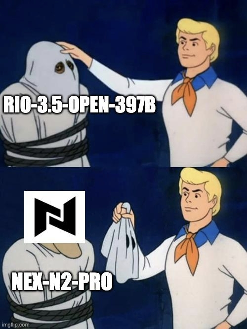
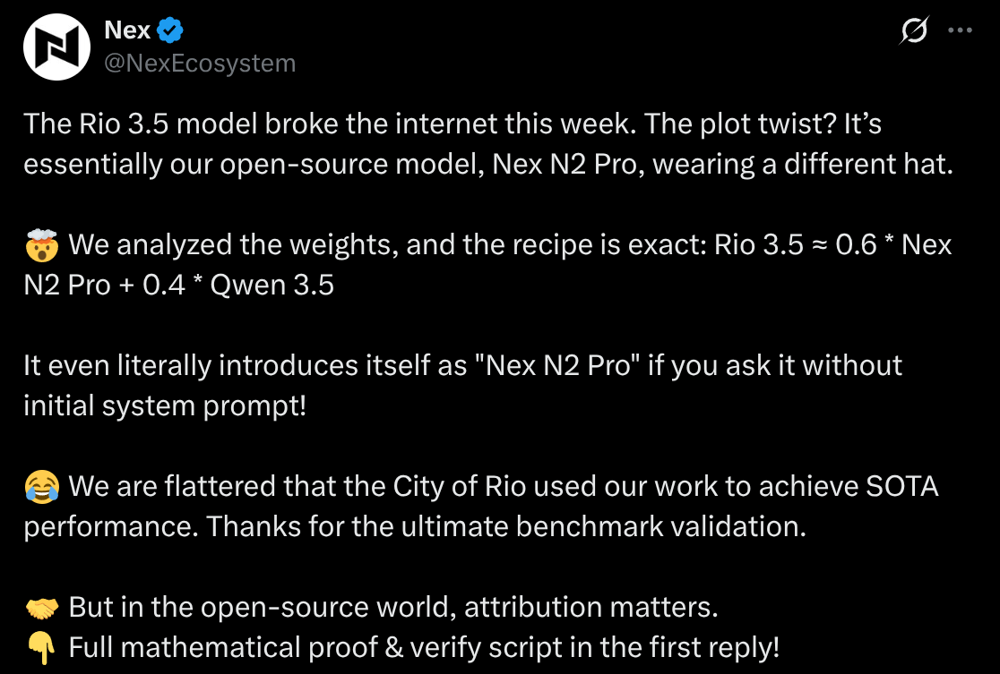

<figure>
  
  <figcaption>The meme is funny because it summarizes the accusation. But let's separate the joke, the technical evidence, and the license question.</figcaption>
</figure>

This week a curious controversy showed up in the open LLM world: **[Rio 3.5 Open 397B](https://huggingface.co/prefeitura-rio/Rio-3.5-Open-397B)**, presented by the [City of Rio / IplanRIO in the Rio 3 Open announcement](https://prefeitura.rio/cidade/prefeitura-do-rio-anuncia-projetos-de-inovacao-que-serao-testados-na-cidade/) as an open model.

The accusation: in practice, the published checkpoint, meaning the model weights file, was a direct blend of **[Nex-N2-Pro](https://huggingface.co/nex-agi/Nex-N2-Pro)** and **[Qwen3.5-397B-A17B](https://huggingface.co/Qwen/Qwen3.5-397B-A17B)**, without initial credit to Nex.

The question mark in the title is intentional. "Plagiarism" is a loaded word, especially when we're talking about a model under a permissive license. The right question isn't only "can they use it?" In open source, most of the time they can. The question is: **did they use it, modify it, redistribute it, and give proper credit?** And for an AI model, there's another question just as important: **were they transparent about what was actually done?**

My short conclusion before the long version: Nex's public evidence is strong. Strong enough to say the initially published Rio 3.5 checkpoint looks like an almost linear blend of Nex-N2-Pro and Qwen3.5-397B-A17B.

Rio's own [README](https://huggingface.co/prefeitura-rio/Rio-3.5-Open-397B/raw/main/README.md) was changed after the [Nex issue](https://github.com/nex-agi/Nex-N2/issues/4) to acknowledge Nex + Qwen and say there had been an "incorrect upload".

I did not reproduce the tensor-by-tensor analysis myself. I'm evaluating the evidence Nex published, the public Hugging Face history, and the tests I ran separately in my own benchmark.

This does not prove, legally, "plagiarism" in the classic sense. But it shows a serious attribution and communication failure. And for a public-sector project, with a city government involved, that matters more.

## What the City of Rio announced

In April, the City published a note saying IplanRio had presented **Rio 3 Open**, "a family of six cutting-edge artificial intelligence models, fully free and open."

The official text said the idea was to make Rio recognized as a public innovation hub, capable of developing its own AI solutions "without depending on foreign platforms." It also highlighted an MIT license, free use, modification, and even profit from the technology. Source: [City of Rio, 2026-04-02](https://prefeitura.rio/cidade/prefeitura-do-rio-anuncia-projetos-de-inovacao-que-serao-testados-na-cidade/).

A [Mobile Time](https://www.mobiletime.com.br/noticias/02/04/2026/prefeitura-do-rio-3-llms/) article gave more context: the family would be developed from Qwen, Alibaba's Chinese model.

João Cabaretta, president of IplanRio, reportedly said: "What we did was take the Qwen model, already ready, and from it we modified the model." The article also listed expected city use cases: reading security cameras for suspicious activity, analyzing accountability documents, generating institutional images and videos, and citizen service.

So far, nothing absurd. Taking an open model and adapting it for local use is exactly what many people do. If the city managed to assemble infrastructure, adapt a model, document it, and publish weights, good. I'm in favor of that. I prefer it over another closed contract with a foreign SaaS nobody can audit.

The problem starts with how Rio 3.5 was presented.

On Hugging Face, the [`prefeitura-rio/Rio-3.5-Open-397B`](https://huggingface.co/prefeitura-rio/Rio-3.5-Open-397B) repository initially said the model was "developed by IplanRIO", "Post-trained from Qwen 3.5 397B", with **MIT License**, and acknowledgments to the Qwen Team and SwiReasoning. That older version is still accessible in the Hugging Face history: [README before the correction](https://huggingface.co/prefeitura-rio/Rio-3.5-Open-397B/raw/cd503cdc7aaac2506bf68f6d278503ddb07a83ef/README.md).

The card also promised a frontier-class general-purpose model, with **397B total / 17B active parameters**, a **1,010,000-token** context window, and commercial/research use under MIT. In other words: this wasn't a footnote. It was an ambitious release.

Notice the detail: Qwen appeared as the base. Nex did not.

And this matters because, in Nex's own discussion, someone corrected the narrative by saying Rio **had credited Qwen** early on. That's true: the [second model-card commit](https://huggingface.co/prefeitura-rio/Rio-3.5-Open-397B/commit/a0b566a0ecd25ae6996ccafd377b2162af01077a) already listed `base_model: Qwen/Qwen3.5-397B-A17B`. A comment in the issue points this out too: ["They did say Qwen 3.5 397B was the base model from the beginning..."](https://github.com/nex-agi/Nex-N2/issues/4#issuecomment-4710338431).

So the stronger accusation isn't "they omitted Qwen." It's: **they credited Qwen, but omitted Nex-N2-Pro**, exactly the component Nex's weight analysis says was the majority ingredient in the published recipe.

After Nex opened the issue, the current README said something different:

> "The model was built through a merge of https://huggingface.co/nex-agi/Nex-N2-Pro and https://huggingface.co/Qwen/Qwen3.5-397B-A17B, followed by On-Policy Distillation from a stronger model. We detected an incorrect upload in the previous version, where the merged base version was uploaded instead of the final distilled model. We apologize for the confusion."

Source: [current Rio 3.5 README](https://huggingface.co/prefeitura-rio/Rio-3.5-Open-397B/raw/main/README.md), changed in commit [a778c1e](https://huggingface.co/prefeitura-rio/Rio-3.5-Open-397B/commit/a778c1ec4e21180ee55c3ea016a348e549e75f09).

That sentence changes the story a lot. Before: "post-trained from Qwen." After: "blend of Nex-N2-Pro and Qwen, followed by distillation, but we uploaded the wrong file."

That may be true. There may really have been a wrong upload. But as an outside observer, I can only analyze what was published.

## Nex's accusation

Nex opened issue [nex-agi/Nex-N2#4](https://github.com/nex-agi/Nex-N2/issues/4) on June 14. In my translation/summary, the core accusation is direct:

> `prefeitura-rio/Rio-3.5-Open-397B` is presented as an original 397B model trained by IplanRIO. It is not. Its weights are a direct element-wise blend of our model, Nex, with the official `Qwen3.5-397B-A17B` base — about 0.6 Nex / 0.4 Qwen — and we find no evidence of their own training.

Nex points to two lines of evidence.

First: identity behavior. According to them, Rio's service used a built-in system prompt saying "You are Rio". With that prompt removed, they asked 120 identity questions. The reported result was:

- "Nex": 95/120, or 79.2%.
- "Nex-AGI": 88/120, or 73.3%.
- "Rio": 0/120.

Example response cited by Nex:

> "I am Nex, from Nex-AGI. Nex-AGI is a large-model ecosystem alliance, jointly built by the Shanghai Innovation Institute…"

Source: [Nex comment on identity behavior](https://github.com/nex-agi/Nex-N2/issues/4#issuecomment-4702171801).

That alone doesn't prove everything. A model identifying as another model can happen because of dataset contamination, system prompt, a bad test prompt, or reused fine-tuning. But it's a bad sign when a supposedly "Rio" model never says "Rio" without the mask and says "Nex" very often.

The second piece of evidence is more serious: weight analysis.

Nex's hypothesis is simple. If Rio = α·Nex + (1−α)·Qwen, then for every tensor:

```text
(Rio − Qwen) ≈ α · (Nex − Qwen)
```

They report very consistent values: routed experts with α ≈ 0.571 ± 0.0016 and `cos_fit` 0.993; `lm_head` with 0.574 and 0.991; attention around 0.585 and 0.986; linear-attention projections around 0.586 and 0.984. Source: [Nex comment on weight analysis](https://github.com/nex-agi/Nex-N2/issues/4#issuecomment-4702181710).

This is the part that carries the most weight. High similarity between models in the same family would not be surprising. But tensor-by-tensor collinearity at this level is a different thing. If the equation reproduces across all tensors, it doesn't look like "we trained something similar." It looks like a merge.

The weak point: until someone reproduces it independently, this is still an analysis presented by an interested party. The strong point: it's falsifiable technical analysis, not just a screenshot of a chat.

## Nex's tweet

<figure>
  
  <figcaption>Screenshot of Nex's tweet. Original link: <a href="https://x.com/NexEcosystem/status/2066180407100571714">x.com/NexEcosystem/status/2066180407100571714</a>.</figcaption>
</figure>

Nex's tweet summarizes the accusation in meme form:

> "The Rio 3.5 model broke the internet this week. The plot twist? It's essentially our open-source model, Nex N2 Pro, wearing a different hat."

And continues:

> "We analyzed the weights, and the recipe is exact: Rio 3.5 ≈ 0.6 * Nex N2 Pro + 0.4 * Qwen 3.5"

It also repeats the identity claim:

> "It even literally introduces itself as 'Nex N2 Pro' if you ask it without initial system prompt!"

And closes with the most important sentence:

> "But in the open-source world, attribution matters."

That's it. The most important part isn't "they used our model." Open models exist to be used. If the analysis is correct, the complaint is: they allegedly used it, benefited from inherited performance, announced results, but only gave credit after Nex exposed the blend.

## But what is Nex-N2-Pro?

Before going further, it's worth explaining who Nex is in this story, because it didn't come out of nowhere either.

In the [official model card](https://huggingface.co/nex-agi/Nex-N2-Pro/raw/main/README.md), Nex describes **Nex-N2** as "an agentic model with Agentic Thinking".

Marketing aside, the promise is clear: not just a good chat model, but a model tuned for long agent tasks. Coding, tool calls, terminal execution. The annoying kind of workflow where the model needs to plan, execute, see environmental feedback, fix things, and iterate.

And yes: it is also based on Qwen. The card itself says the two models in the family were post-trained on top of the Qwen3.5 series:

- **Nex-N2-Pro**: built on [`Qwen3.5-397B-A17B`](https://huggingface.co/Qwen/Qwen3.5-397B-A17B).
- **Nex-N2-mini**: built on [`Qwen3.5-35B-A3B-Base`](https://huggingface.co/Qwen/Qwen3.5-35B-A3B-Base).

So Nex is not saying "we created a base architecture from scratch." It is saying: we took Qwen as a base and did agent-focused post-training on top. The promised difference is in that post-training.

They call the framework **Agentic Thinking**, split into two ideas:

- **Adaptive Thinking**: the model decides when to think less and act quickly, or when to spend more reasoning on critical decisions.
- **Coherent Thinking**: keeping one consistent reasoning paradigm across general tasks, coding, and agent tasks, instead of treating reasoning, tool use, and execution as separate islands.

There are practical details too: they recommend a customized fork of `sglang`, use `reasoning-parser qwen3`, `tool-call-parser qwen3_coder`, talk about robust function calling, and list agent/coding benchmarks where Nex-N2-Pro would land close to proprietary models like GPT-5.5 and Opus 4.7.

Of course, vendor benchmarks always need salt. But the thesis is this: **raw Qwen is the base; Nex is the agent post-training and packaging that should turn that base into a better model for real agent work**.

That matches my independent benchmark. Qwen3.5-397B-A17B base did badly: 42/C. Nex-N2-Pro did well: 83/A. Same base, brutal difference. At least in my Rails/RubyLLM test, Nex's value doesn't seem to be "it has 397B parameters." Qwen already had that. The value is in fixing agent behavior the Qwen base did not have: using a real API, finishing the task, validating the environment, handling errors.

That distinction matters for the Rio controversy. If Rio 3.5 used Nex as the main ingredient, it's not just "Qwen under another name." It would have used precisely the part that made Qwen useful for agent tasks. And that part was Nex's work.

## What Rio effectively answered

The most concrete public answer I could verify was the README change on Hugging Face. Rio now says:

1. The model is built through a merge of Nex-N2-Pro and Qwen3.5-397B-A17B.
2. After that there would be an **On-Policy Distillation** step from a stronger model.
3. The initially uploaded checkpoint was the "merged base version", not the final distilled model.
4. They were working to reupload the correct model.

The Hugging Face commit history also shows that, after the issue, many files from `model-00001.safetensors` through `model-00097.safetensors` and a benchmark image were removed. You can see it through the [Hugging Face commits API](https://huggingface.co/api/models/prefeitura-rio/Rio-3.5-Open-397B/commits/main).

Here comes my normal engineer skepticism. "We uploaded the wrong file" is a possible explanation. It happens. But when the wrong file, according to Nex's analysis, is exactly a mathematical combination of upstream models with no initial credit, and the correction arrives an hour after the accusation, it's hard to call it a mere operational detail.

Not impossible. Hard.

## What model merging is

For anyone not following this niche, model merging isn't magic. It's a fairly common technique: you take two compatible checkpoints, usually from the same architecture, and combine the weights. The simplest version is literally a linear interpolation:

```text
final_model = 0.6 * model_A + 0.4 * model_B
```

There are more sophisticated variations: layer-wise merge, task vectors, TIES, DARE, SLERP, different weights per module. But the concept is this: you're not training from scratch. You're combining already trained parameters.

Can this work? Sometimes. Especially when the models share the same base and were tuned in complementary directions. It can preserve capabilities from one and recover base behavior from another. It can also make things worse. Merging is statistical alchemy: there is technique, but also a lot of empirical testing.

And, most importantly: **merging costs nowhere near what it costs to train a 397B model**. You need to download huge checkpoints, run scripts, test weights, maybe benchmark, maybe tune a few things. **It is not zero work. But it is not "we trained a frontier model."**

If Nex's evidence is correct, the published checkpoint was something like:

```text
Rio 3.5 ≈ 0.57 to 0.60 * Nex-N2-Pro + 0.40 to 0.43 * Qwen3.5-397B-A17B
```

That looks more like integration engineering than model training. It is not the same kind of technical merit as post-training or distilling a 397B and presenting it as your own advance.

## What distillation means here

Distillation is a different thing. In LLMs, it usually means using a stronger teacher model to generate answers, reasoning traces, or preferences, and training a student model to imitate that behavior. You can distill style, reasoning ability, response format, a specific domain, tool use. The student can be smaller, cheaper, faster, or simply adapted to a goal.

Rio's corrected README says **On-Policy Distillation from a stronger model**. Roughly translated: they would have used a stronger model to generate training data or signals under a generation policy closer to the student itself, and then trained the final Rio 3.5.

That, if it exists, is real work. It requires a pipeline, data, compute, evaluation. The issue is that Nex did not analyze this alleged final distilled model. It analyzed the checkpoint that was public. And Rio now says that checkpoint was the "merged base version" uploaded by mistake.

So the factual state is:

- initially published checkpoint: accused of being a Nex + Qwen merge;
- initial README: credited Qwen, not Nex;
- corrected README: acknowledges Nex + Qwen merge and says the final distilled model was not that file;
- correct final model: still open, until it is reuploaded and analyzed.

Without the final checkpoint, we can't evaluate the distillation. We can evaluate the communication.

## The license: Apache allows it, but usually requires preserving notices

This is where a lot of online discussion gets dumb.

I am not a lawyer and this is not legal advice. Also, the exact application of open-source licenses to model weights still has gray areas. But in a practical reading of Apache-2.0, the operational rule is not "use it and erase the traces."

Nex-N2-Pro declares **Apache-2.0** on Hugging Face: [Nex-N2-Pro README](https://huggingface.co/nex-agi/Nex-N2-Pro/raw/main/README.md). Qwen3.5-397B-A17B also declares **Apache-2.0**: [Qwen3.5-397B-A17B README](https://huggingface.co/Qwen/Qwen3.5-397B-A17B/raw/main/README.md).

Apache-2.0 is permissive. It allows reproduction, modification, derivative works, sublicensing, and distribution. Commercially too. So it is not "theft" simply because they used Nex and Qwen. If the license allows use, use is part of the game.

But permissive does not mean "no obligations at all." The [Apache-2.0 license](https://www.apache.org/licenses/LICENSE-2.0.txt) requires, among other things:

- giving recipients a copy of the license;
- marking modified files with prominent change notices;
- preserving copyright, patent, trademark, and attribution notices from the source form;
- including NOTICE when the original work has an applicable NOTICE.

Rio 3.5 initially declared **MIT License** and credited Qwen/SwiReasoning, but not Nex. If the distributed checkpoint was in fact derived from Nex-N2-Pro, that is at least an attribution failure. It may be fixable. It seems to have been partially corrected in the README. But the error happened at launch, exactly at the moment of highest visibility.

And there is another nuance: **you can't simply take two Apache-2.0 components, generate a derivative, and announce the resulting package as if it were only MIT, without preserving the Apache obligations from the upstreams**.

Apache-2.0 is permissive and allows you to distribute derivatives under different terms for your modifications, but with conditions: you still need to provide the Apache license, preserve copyright/attribution notices, and carry NOTICE when one exists.

So "MIT" may appear as the license for Rio's added layer, but it cannot erase Apache-2.0 from Nex and Qwen or imply the whole derivative is free of those obligations. If the original card said only MIT and did not include the applicable Apache credits/notices, that can stop being just an etiquette slip and become a possible license-compliance problem.

There's an irony here: they could have avoided 90% of the controversy with one honest sentence from the start:

> "Rio 3.5 is a merge/fine-tune built on Nex-N2-Pro and Qwen3.5-397B-A17B, with IplanRIO adaptations for Portuguese and public-sector use."

Done. Maybe people would still complain politically, but the technical criticism would be much weaker. The problem is looking like you did it alone.

## How much work does it look like?

This is the speculative part, so I'll mark it as speculation.

If what was published was only the base merge, the technical work may have been much smaller than the public narrative suggested. Merging two giant models is not clicking a button in a browser, of course. You need storage, scripts, machines, validation, shard handling, uploading almost a hundred `safetensors`, tests, documentation. It is operational work.

But it is not the same kind of work as truly training, post-training, or distilling a 397B.

And the phrase "open AI model trained in Rio with public funding over the last year," as Eduardo Cavaliere said in this [tweet](https://x.com/CavaliereRio/status/2065984620626129026), creates a very different expectation from "we merged two Apache models and maybe distilled afterward."

Rafael Coelho replied in another [tweet](https://x.com/RafaelC38655518/status/2066044310206771250) that they had not spent public money and had swapped old training code for GPU credits. There may be an administrative explanation there, but from the outside the communication is confusing.

I am not claiming administrative wrongdoing. I am saying the public narrative became inconsistent.

And even the **R$ 500,000** figure, cited by Mobile Time about the previous generation, needs scale. In serious LLM research, that is not a lot of money. Add salaries for a few researchers, infrastructure, storage, cloud GPU hours, failed attempts, evaluation, data engineering, and that amount disappears quickly. It's a drop in the ocean compared with the cost of training or post-training a genuinely large model.

So I would not use "R$ 500,000" as automatic proof of waste. That's not the point. The point is different: that amount also does not, by itself, support a narrative that a heavy, original 397B training run happened. For that kind of scale, serious research would spend much, much more.

Was it publicly funded? Was it not? Did it cost R$ 500,000 in the previous generation? Was it GPU credits? Was it a year of training? Was it a merge? Was it distillation? Was it a wrong upload?

Maybe all those sentences have different contexts. But when technical communication is bad, the public stitches everything together and it becomes a mess.

## What my benchmark says about Nex and Qwen

Now comes the part where I can speak from my own data. In my [llm-coding-benchmark](https://github.com/akitaonrails/llm-coding-benchmark), I tested both **Nex-N2-Pro** and the **Qwen 3.5 397B A17B base**.

My benchmark measures one specific programming/Rails task. It is useful as a signal, not as a general capability evaluation.

I did not test Rio 3.5 directly for a simple reason: it is too large for my local machine. My Strix Halo has 128 GB of unified RAM, great for many things, but not enough to run a 397B model like this comfortably. To test it properly, I would need to rent a cloud machine, deal with setup, download hundreds of gigabytes, organize shards, start an inference server, pay by the hour, and still risk the correct checkpoint not even being available at that moment.

I was not up for all that work for a quick analysis post. So I used the best available approximation: test the originals that the controversy itself puts in the recipe, Nex-N2-Pro and Qwen3.5-397B-A17B. If the published Rio was basically a merge of those two, and if there is no public evidence of much effective work on top of that checkpoint, comparing the ingredients already says a lot. It does not replace a direct Rio test, but it puts the performance claim in perspective.

There's another detail: in [Rio's own old model card](https://huggingface.co/prefeitura-rio/Rio-3.5-Open-397B/raw/cd503cdc7aaac2506bf68f6d278503ddb07a83ef/README.md), the table said "Gains Over Base Model", but Rio **did not beat Qwen 3.5 base on everything**.

It lost on MMLU-Redux (94.6 vs 94.9), MMMU-Pro (78.4 vs 79.0), and VideoMMMU (81.6 vs 84.7), tied on MCP-Atlas (74.2 vs 74.2), and in some cases won by small margins, like MMLU-Pro (88.0 vs 87.8) and MathVision (89.1 vs 88.6). So even by the self-reported numbers, without independent auditing, the story was more "improves on several benchmarks" than "better than Qwen at everything."

And yes, where Rio said it beat Qwen, that also fits Nex's hypothesis: **Nex-N2-Pro was already better than the Qwen base precisely because of Nex's work**. I saw this in my own benchmark: Qwen3.5-397B-A17B base scored 42/C, while Nex-N2-Pro scored 83/A. So a Rio that mixes Nex with Qwen can very well look better than Qwen. For the published checkpoint, the simpler explanation is not "Rio invented a miracle technique"; it's "it inherited much of the gain Nex had already produced on top of Qwen."

Relevant commits:

- [`11a9c68`](https://github.com/akitaonrails/llm-coding-benchmark/commit/11a9c6850485215bb6ccc2ab8e3d1c60e175e62b): adds Nex-N2-Pro, 83/100, Tier A.
- [`e2af88c`](https://github.com/akitaonrails/llm-coding-benchmark/commit/e2af88c77c4c5abd95438d5a6132d2bfdf7d943b): adds Qwen 3.5 397B A17B base, 42/100, Tier C.

In the final benchmark table, Nex landed here: [rank #10, 83/100, Tier A](https://github.com/akitaonrails/llm-coding-benchmark/blob/e2af88c77c4c5abd95438d5a6132d2bfdf7d943b/docs/success_report.md#L77-L89).

```text
Nex-N2-Pro | 83 | A | RubyLLM OK | OpenRouter | 25m | free
```

The Qwen base landed here: [rank #28, 42/100, Tier C](https://github.com/akitaonrails/llm-coding-benchmark/blob/e2af88c77c4c5abd95438d5a6132d2bfdf7d943b/docs/success_report.md#L102-L108).

```text
Qwen 3.5 397B A17B (base) | 42 | C | RubyLLM not OK | OpenRouter | 15m | ~$0.58
```

That's an interesting control. Same backbone, completely different result.

The Qwen base hallucinated the RubyLLM API (`chat.system`, `chat.user`, `response.text`) and even created the app inside a nested `chat-app/` directory, violating the expected benchmark shape.

Nex, on the other hand, used the real API: `RubyLLM.chat`, `chat.ask`, `response.content`, booted locally, passed Docker, compose, and real chat through OpenRouter. The report compares it directly: [Qwen base 42/C vs Nex tuned 83/A, a 41-point jump](https://github.com/akitaonrails/llm-coding-benchmark/blob/e2af88c77c4c5abd95438d5a6132d2bfdf7d943b/docs/success_report.md#L570-L581).

That puts Rio 3.5 in perspective. If it really was 60% Nex + 40% Qwen base, it makes sense that it would inherit a lot of Nex's agent capability. But it also makes sense to suspect that mixing in 40% of a model that did much worse in my programming test could degrade pure Nex in some scenarios.

So I won't claim "Rio is worse" as my own measurement. What I can say is: **the Nex component is good; the Qwen base component was bad in my test; a Rio that was only Nex diluted with Qwen base should not be sold as an obvious advance over pure Nex without a reproducible benchmark against Nex itself**. From what has been published so far, it does not look like the work on top of the merge improved the ranking in a demonstrable way. If it did, publish the correct model and reproducible tests.

And even Nex, which did very well, was not at the top of my open or open-ish ranking. It scored 83. The best so far were Kimi K2.6 and GLM 5.2 at 87, and Kimi K2.7 Code at 86. Nex is Tier A, free, impressive. But it is not magic. It is a good agent-focused fine-tune on top of a family that, raw, badly trips on library APIs.

So as a user, my practical conclusion is simple: **if I had to choose today, I would use Nex-N2-Pro directly**. Not because Rio is automatically useless forever, but because the published checkpoint did not show a clear, auditable gain over the most valuable ingredient in the recipe. If the gain came from Nex, why not use Nex? Rio becomes technically interesting again only if the correct final distilled model appears, with reproducible evaluation showing a real advantage over pure Nex-N2-Pro.

## So was it plagiarism?

My honest answer: **I would not call it plagiarism as a legal conclusion**. I would call it a poorly attributed repackaging of the initially published checkpoint, with strong evidence of a direct merge and a correction that only appeared after exposure.

Open source is not "you can't use it." Open source is "you can use it, but respect the license and give credit." If Nex and Qwen are Apache-2.0, the city could build on top of them. It could merge. It could distill. It could publish a derivative. It could even license its own layer under MIT, as long as it does not erase the Apache obligations from the components and preserves the required notices.

The mistake was letting the public narrative look like an original creation, with incomplete credit. And then, when Nex showed up with tensor-by-tensor math, the README changed.

Maybe there is a real final distilled model. If there is, publish it. Preferably with:

- a clear card stating the base, merge, distillation, and training data;
- a license compatible with Qwen and Nex;
- explicit credits;
- a reproducible evaluation script;
- a benchmark against pure Nex-N2-Pro and Qwen base;
- an explanation of the "incorrect upload."

That would close much of the technical discussion. Maybe not the political one, but the technical one, yes.

## What to learn from this

This story is a good reminder for everyone surfing open models now. The derivation chain matters. Not because of academic bureaucracy, but because it is part of trust.

If you fine-tune on top of Qwen, say Qwen. If you merge with Nex, say Nex. If you distill from a closed teacher, say you distilled, even if you can't name the teacher. If you uploaded the wrong checkpoint, explain exactly which one was wrong, which one is right, and how someone can verify it.

The worst path is trying to look bigger than you are. Because open LLMs are an environment where weights can be downloaded, compared, and audited. You can hide the narrative for a while, but you cannot hide linear algebra.

In the end, Nex may have received the best involuntary validation of its own model: if a city government used Nex-N2-Pro as 60% of the recipe for a model announced as "state of the art," then Nex is good. But involuntary validation does not pay the credit bill.

And credit, in open source, is not fussiness. It is the basic currency of the game.
