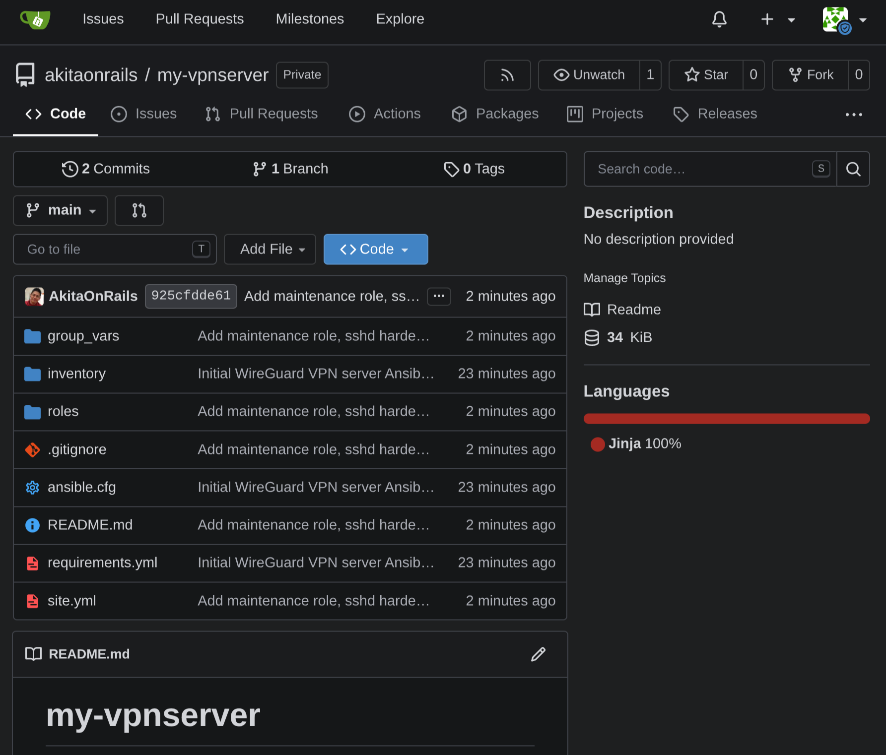

Last week I wrote about [the Discord censorship and Brazil's Digital ECA law](/en/2026/08/13/understanding-the-discord-censorship-and-brazils-digital-eca/), the Digital ECA ("Estatuto Digital da Criança e do Adolescente", the digital version of Brazil's Child and Adolescent Statute): the ANPD (Brazil's data protection authority, now also the country's de facto internet regulator) ordered the Go Live feature shut down nationwide because end-to-end encryption prevents content surveillance, and in the same package came the first sentence enhancement in Brazilian history for committing a crime "using a VPN". After that article, the question I got the most was the obvious one: *"OK, so what do I do?"*

This article is the answer: a practical guide, from easiest to hardest, to keep your communication channels standing as the siege tightens. Because the siege **is** tightening, and you should understand its pace before picking your tools.

## The track record: none of this is new

Anyone surprised by the Discord case was not paying attention. The Brazilian judiciary has been blocking communication services for over a decade, always steamrolling millions of innocent users to reach half a dozen suspects:

- **WhatsApp, 2015 and 2016**: blocked [three times by lower-court judges](https://g1.globo.com/tecnologia/noticia/2022/03/18/whatsapp-ja-foi-bloqueado-por-decisao-judicial-em-2015-e-2016-no-brasil.ghtml), always because the company would not hand over conversations that, by design, it cannot read.
- **Telegram, 2022 and 2023**: suspended [for two days by order of Justice Alexandre de Moraes in March 2022](https://www.gazetadopovo.com.br/republica/stf-voltara-a-julgar-bloqueio-do-whatsapp-moraes-ja-suspendeu-telegram/), and again by a federal judge in 2023. [Migalhas has the full timeline](https://www.migalhas.com.br/depeso/414499/stf-alem-do-x-relembre-os-bloqueios-do-whatsapp-e-telegram-no-brasil).
- **X/Twitter, 2024**: the landmark. [Nationwide suspension from August 30 to October 8](https://itforum.com.br/noticias/de-outubro-a-outubro-confronto-x-e-stf/), **40 days**, by a single justice's order. And here is the detail that matters for this guide: the decision included [a fine of R$ 50,000 (~US$ 10,000) per day for any individual who accessed X through a VPN](https://www.gazetadopovo.com.br/mundo/crise-eua-moraes-twitter-files-lei-magnitsky/), an order for app stores to remove VPN apps (walked back hours later), and [the Federal Police and Anatel (the telecom regulator) producing reports on who bypassed the block](https://istoedinheiro.com.br/pf-e-anatel-enviam-ao-stf-relatorios-sobre-acessos-ao-x-mesmo-com-bloqueio) to support the fines.

Notice what happened there: for the first time, using a neutral privacy tool became, by itself, punishable conduct in Brazil. Nobody was fined in the end, but the infrastructure to fine people was built, tested and documented. And in 2026 Congress voted and the president signed a sentence enhancement for crimes committed with a VPN. The X precedent stopped being an exception and became repertoire.

> **Keep this:** in the X case, the Brazilian state already treated VPN users as offenders, already tried to pull VPNs from app stores, and already requested reports on who bypassed the block. All of it documented, in court orders and public reports.

## The endgame: the Chinese model

I have little doubt that very well-positioned people in government look at [China's Great Firewall](https://freedomhouse.org/country/china/freedom-net/2024) with envy, not horror. And it is worth understanding what it is, because it defines the limit of the game.

The Firewall goes far beyond blocking websites. It is deep packet inspection (DPI) at national scale, running on the country's internet backbone: all traffic is classified in real time, known VPN protocols are identified by their handshake shape and dropped, Tor is blocked by default, and only **state-approved VPNs** (meaning, with a backdoor) operate legally. Ordinary citizens caught using unauthorized VPNs get fined. And even when the traffic cannot be read, the metadata gives the game away: who talks to whom, when, for how long.

That is why the honest answer to "can you bypass a Firewall like that without being noticed?" is: **no, not for an ordinary citizen**. Against a state-level firewall of that caliber, no consumer tool makes you invisible. At best it makes you too expensive to be worth persecuting at scale. Anyone selling you total invisibility is lying.

The good news is that Brazil is nowhere near that point. Censorship rarely arrives all at once: it comes in steps, and each step has a matching defense. The rest of this guide is that staircase, step by step. The logic behind everything that follows is a single one: **censorship is a matter of cost**. Our job is to make blocking expensive, technically and politically, until mass deployment becomes impractical.

> **Keep this:** against a complete state firewall, no tool makes you invisible, only too expensive to persecute at scale. The game is climbing your staircase before the censor climbs his.

## Phase 1: Commercial VPN, the minimum everyone should have

Start with the obvious. A VPN (virtual private network) creates an encrypted tunnel between your device and a provider's server. Your ISP (internet service provider) now sees only a scrambled flow going to a single address; the sites you visit see the VPN's IP, not yours. I explain it in depth, with the networking theory underneath, in [Akitando 126](https://akitaonrails.com/2022/08/29/akitando-126-criando-uma-rede-segura-introducao-a-redes-parte-6-vpn-e-nas/) (in Portuguese).

What a VPN **does**: hides your traffic from your ISP, swaps your exit IP, gets you out of geo-blocks and of court-ordered DNS/IP blocks. What it **does not do**:

- **It does not make you anonymous.** The VPN provider sees all your traffic in place of your ISP. You did not eliminate the watcher, you just picked a different watcher.
- **It does not hide your identity if you paid by credit card.** A credit card subscription ties the VPN account to your tax ID. If authorities show up at the provider with a court order, your name is there.
- **It does not protect content past the tunnel.** From the VPN exit to the final website, the web's normal encryption (HTTPS) applies. The VPN is one leg of the path, not the whole path.

That said, for the early phases of the siege it does the job. My recommendations, in order:

- **[ProtonVPN](https://protonvpn.com/)**: Switzerland, outside easy jurisdiction, open source and audited, a no-logs policy tested in court, a decent free tier, and it accepts payment even in cash by mail.
- **[Mullvad](https://mullvad.net/)**: Sweden, the most paranoid on the market: it does not even ask for an email, your account is a random number. Flat €5/month, accepts cash in an envelope and cryptocurrency. It is the closest thing to an "identity-less VPN" that exists as a commercial product.
- NordVPN and the like work technically, but their money goes more to marketing than to privacy posture. Among the big ones, I stick with the two above.

**The limit of this phase** is well known: the exit IPs of famous VPNs are public and catalogued. An order from ANPD or Anatel to national ISPs to block those ranges is technically trivial, and the X case showed that pulling the app from the store is also on the menu. When (not if) that happens, the commercial VPN dies in a day. That is why Phase 2 exists.

> **Keep this:** a commercial VPN is a seatbelt: use it always, but know it depends on three things outside your control. The app staying in the store, the IPs staying unblocked, and the provider staying honest.

## Phase 2: Self-hosted VPN, your own tunnel

The move here changes shape: instead of subscribing to a service with millions of users and catalogued IPs, you rent a cheap little server outside Brazil and build your personal VPN. There is no public list with your IP for the censors to download. You are one user on an unknown IP, indistinguishable from any other traffic until someone looks closely.

**Picking the provider (and why not AWS, Azure or Google Cloud).** The big clouds have huge, public, well-mapped IP ranges (ASNs). Blocking them wholesale is one line in a routing table; the only brake is collateral damage (plenty of legitimate Brazilian businesses live there), and other countries have paid that price in crises. Smaller providers dilute that target. Options I would consider, from mid-sized to small:

| Provider | Based in | Why |
|---|---|---|
| [Hetzner](https://www.hetzner.com/cloud) | Germany/Finland | Cheap, reliable, out of easy reach |
| [OVH](https://www.ovhcloud.com/) / [Scaleway](https://www.scaleway.com/) | France | Same, European jurisdiction |
| [Contabo](https://contabo.com/) | Germany | Very cheap, low profile |
| [Vultr](https://www.vultr.com/) / [DigitalOcean](https://www.digitalocean.com/) | US/global | Mid-sized, known but not giant |
| [BuyVM](https://my.frantech.ca/), [HostHatch](https://hosthatch.com/), [LiteServer](https://liteserver.nl/) | US/Europe | Small, off every obvious list |

A US$ 3 to 5 machine with 1 GB of RAM is plenty for a personal VPN. **Important caveat:** paying for a VPS (virtual private server) with a credit card leaves a trail just like the commercial VPN: your name is in the provider's records, and the provider can be legally compelled. Some accept cryptocurrency, which reduces (does not eliminate) the trail. For most people, at this phase, the signup risk is acceptable: you are not hiding from a named investigation, you are getting out of the aim of a mass block.

### Step by step: WireGuard with wg-easy

I will use [wg-easy](https://github.com/wg-easy/wg-easy), which packages WireGuard (the modern, fast, auditable VPN protocol) into a Docker container with a web panel and QR codes to set up your phone in seconds.

**1. Rent the VPS.** Ubuntu 24.04, the smallest machine available, in a region outside Brazil (Amsterdam, Frankfurt and Helsinki are classic choices for jurisdiction and acceptable latency).

**2. Log in and update:**

```bash
ssh root@YOUR_IP
apt update && apt upgrade -y
```

**3. Install Docker:**

```bash
curl -fsSL https://get.docker.com | sh
```

**4. Generate the panel password hash** (wg-easy does not accept a plaintext password; write down the password you choose):

```bash
docker run --rm -it ghcr.io/wg-easy/wg-easy wgpw 'YourStrongPasswordHere'
# the output looks like: PASSWORD_HASH=$2b$12$abc...
# in the command below, double every dollar sign: $ becomes $$
```

**5. Start the container:**

```bash
docker run -d \
  --name=wg-easy \
  -e WG_HOST=YOUR_IP \
  -e PASSWORD_HASH='$$2b$$12$$abc...' \
  -v ~/.wg-easy:/etc/wireguard \
  -p 51820:51820/udp \
  -p 51821:51821/tcp \
  --cap-add=NET_ADMIN \
  --sysctl="net.ipv4.conf.all.src_valid_mark=1" \
  --sysctl="net.ipv4.ip_forward=1" \
  --restart unless-stopped \
  ghcr.io/wg-easy/wg-easy
```

**6. Open the firewall.** Port 51820/UDP is the tunnel itself. Port 51821/TCP is the panel: **do not leave the panel exposed to the internet**. The right way is to open it only through an SSH tunnel (`ssh -L 51821:localhost:51821 root@YOUR_IP` and browse to `localhost:51821`), or to open 51821 just long enough to create your clients and close it right after.

**7. Create the clients.** In the panel, one click generates a client with a QR code. Point the official WireGuard app (Android/iOS) camera at it and you are done. On a laptop, download the config file and import it into the WireGuard client.

Done: all of your device's traffic exits through your European server. Your Brazilian ISP sees only a scrambled flow to some random IP in Germany.

### And on your machine, how do you use it?

The server is half the story. On your device, the ritual goes like this:

**On your phone (Android/iOS):** install the official [WireGuard](https://www.wireguard.com/install/) app from the store (or from F-Droid on Android). Tap the **"+"**, choose "Scan from QR code" and point it at the code the wg-easy panel showed. A new "tunnel" appears in the list: one tap on the switch and you are in. On iOS, enable "On-Demand" in the tunnel settings so it reconnects by itself when you switch networks (Wi-Fi to 4G, for instance).

**On your laptop (Windows/macOS):** download the official WireGuard client for your system, click "Import tunnel(s) from file" and select the `.conf` you downloaded from the panel. One click on "Activate" and done. Important detail: the official client has a **"Block untunneled traffic"** option (the kill switch): turn it on. If the tunnel drops, your internet stops instead of leaking through your real IP.

**On Linux:** copy the `.conf` to `/etc/wireguard/wg0.conf` and bring it up with `sudo wg-quick up wg0` (plus `sudo systemctl enable wg-quick@wg0` to start it at boot). Or import the file straight into NetworkManager through the graphical interface, if you prefer clicking to typing.

A complete client `.conf`, for reference, looks like this:

```ini
[Interface]
PrivateKey = <THIS device's private key>
Address = 10.10.0.2/32
DNS = 1.1.1.1

[Peer]
PublicKey = <server public key>
Endpoint = SERVER_IP:51820
AllowedIPs = 0.0.0.0/0
PersistentKeepalive = 25
```

Two details worth their weight in gold here. `PersistentKeepalive = 25` keeps the tunnel alive when you are behind NAT (home network, 4G), preventing the connection from silently dying. And `AllowedIPs = 0.0.0.0/0` is what pushes **all** traffic into the tunnel; without it, only traffic to the VPN's own IPs goes out encrypted. (The `DNS =` line works fine on Windows, macOS and phones; on Linux with systemd-resolved it can get in the way, as I explain in the common mistakes below.)

**Checking that it worked:** with the tunnel active, run `curl ifconfig.me` in a terminal (or open `ipleak.net` in the browser). It must show your VPS IP, not your home one. If your network has IPv6, check separately with `curl -4 ifconfig.me` and `curl -6 ifconfig.me`: **both** must show the server. And visit `dnsleaktest.com`: DNS must exit through the tunnel too. If your ISP's DNS server shows up, there is a leak to fix.

**Minimum maintenance:** enable `unattended-upgrades` so the system patches itself, use SSH keys instead of passwords, and install nothing else on that machine. Small surface, small risk.

### The 2026 way to do this: let the AI configure it

If you got stuck on some step, remember it is 2026: you no longer need to master every command in this guide. I went down that path myself. I rented the VPS, handed the SSH access to the AI agent and asked for the full setup; on the other side, on my own machine, it imported the `.conf`, brought up `wg-quick`, enabled it at boot and checked for leaks at the end. Today my server is a reproducible Ansible playbook (kill the VPS, spin up another, run one command) and my laptop's config follows the same pattern. All in **private** repositories, private on purpose: VPN configuration is not the sort of thing I want strangers peeking at.



*Mine, running on my own Gitea: private, versioned, and the whole server comes back up with one command.*

And if you are going to ask an AI to configure it, skip the generic "install me a VPN" and hand over the real requirements. Something like this:

```text
Turn this fresh Ubuntu 24.04 VPS into a robust WireGuard server,
preferably through an idempotent Ansible playbook (I want to be able to
destroy the VPS and recreate everything by running one command).
Requirements:

- WireGuard managed by wg-quick@wg0, server key generated on the server
  itself (mode 0600), no exposed web panel
- Dual-stack tunnel: IPv4 and IPv6 (fd00::/64 ULA subnet with NAT66), so
  no traffic leaks outside on networks with native IPv6
- ufw denying everything except SSH and the WireGuard UDP port
- key-only sshd (no passwords), fail2ban on sshd, unattended-upgrades
  with no automatic reboot
- Peers declared as data in a config file: adding a client = adding one
  entry and running the playbook again
- Generate client .conf files with PersistentKeepalive=25, full-tunnel
  AllowedIPs and QR codes via qrencode
- At the end, print the verification commands (curl -4/-6 ifconfig.me,
  wg show)

Finally, hand me a short operations README: how to add a client, how to
update, when to reboot.
```

The difference between a "working" server and a solid one lives entirely in those requirements: dual-stack, closed firewall, passwordless sshd, peers as data, reproducibility. The technical barrier of this entire article has, in practice, become a conversation.

### Common mistakes (and how to avoid them)

I keep seeing the same stumbles whenever someone sets up their first self-hosted VPN. All avoidable:

- **Exposing the wg-easy panel to the internet.** The number one classic mistake. The panel is the key to the vault: open on port 51821, any botnet scan finds it within hours. SSH tunnel always, open port never.
- **Weak or recycled passwords on the panel and SSH.** An entire VPN protected by `changeme123` is worse than no VPN. And disable SSH password login for good (`PasswordAuthentication no` in `sshd_config`) once your key is set up.
- **Thinking you are anonymous because the IP is "yours".** The VPS is in your name, paid with your card. It protects you from mass blocking, not from an investigation with your name on it. The wrong level of paranoia creates a false sense of security, which is worse than none.
- **A VPS in Brazil or from a Brazilian company.** I have seen people build a "privacy VPN" on a national provider. If the court order arrives in the same country, you did not leave the reach, you just changed shelves. Server abroad, jurisdiction abroad.
- **Handing out access to half the world.** Each extra person is one more device, one more usage pattern, one more mouth. Close family, fine; a 40-contact group, no. The more people on the same IP, the faster it lands on some list.
- **Using the same machine for other things.** Personal blog, Telegram bot, seedbox: all of that grows the attack surface and ties together identities you wanted separate. The VPN VPS is for the VPN only.
- **Trusting without testing for leaks.** After setting up, test: `ipleak.net` or `dnsleaktest.com` with the VPN on. If your real IP or your ISP's DNS shows up, something is wrong, and this is the only way you find out.
- **Forgetting IPv6.** This one got even me: an IPv4-only tunnel on a network with native IPv6, and all the v6 traffic goes around the VPN, in the clear, without you noticing. Either the tunnel is dual-stack, or half of your traffic leaks. Test with `curl -6 ifconfig.me`.
- **The `DNS =` line breaking the Linux client.** On systemd-resolved systems (Ubuntu, Fedora and the like), `wg-quick` calls openresolv to write the DNS, openresolv refuses to touch the `/etc/resolv.conf` owned by systemd-resolved ("signature mismatch" error) and the whole interface fails to come up. If your system DNS already works fine, just remove the line: queries ride the tunnel anyway.
- **Losing the printer, the NAS and the local network.** With `AllowedIPs = 0.0.0.0/0`, even traffic inside your own home tries to go through the tunnel. The fix is a policy routing rule evaluated before WireGuard's own rules: `PostUp = ip rule add to 192.168.0.0/16 lookup main priority 1000` (plus the matching `PostDown` to undo it on shutdown).
- **Chaining `wg-quick down && up`.** `down` returns an error when the interface is already down, and with `&&` the `up` never runs. Run `up` on its own.
- **Installing and abandoning.** A server without updates for a year is a server with known vulnerabilities. And test the connection from time to time: what works today can be fingerprinted tomorrow.
- **No backup of the configuration.** The `~/.wg-easy` directory holds everything (keys, clients). Keep an encrypted local copy. If the VPS dies or gets shut down by the provider, you bring another one up in ten minutes instead of starting from zero.

> **Keep this:** a US$ 5 VPS outside Brazil running WireGuard gets you out of any mass block based on catalogued IPs. The price is your signup record at the provider: acceptable against blocking, insufficient against a named investigation.

## The invisible enemy: DPI

So far I have assumed the censor blocks **addresses**. Their next level is blocking **formats**, and that is where deep packet inspection (DPI) lives.

Even encrypted, a VPN tunnel has a signature. The initial handshake of WireGuard and OpenVPN has characteristic packet sizes, sequences and timings. The content is unreadable, but the shape screams "I am a VPN". China does exactly this at national scale: it does not need to read your traffic, it only needs to recognize the protocol and drop the connection.

> **Keep this:** the censor does not need to read your traffic to block you. Recognizing the tunnel's shape is enough. That is why obfuscation exists.

The technical answer is **obfuscation**: making the tunnel look like something else.

- **[AmneziaWG](https://amnezia.org/)**: a WireGuard fork that injects junk packets and scrambles headers until the signature vanishes. Same audited WireGuard base, free apps for every platform, and it points at the same kind of VPS from Phase 2. If you set up wg-easy, migrating to Amnezia is the natural step when DPI arrives.
- **udp2raw**: wraps WireGuard's UDP traffic inside fake TCP packets that look like an ordinary connection.
- **Shadowsocks**: born in China precisely for this, an encrypted proxy designed to have no recognizable signature.

Notice we are still talking about free tools and a US$ 5 VPS. The cost rises for the censor much faster than for you.

## Phase 3: when even your VPS is not enough

If the scenario degrades to national DPI with protocol blocking, the game becomes heavy camouflage and redundancy. The real options, in order of effort:

**Protocols that disguise themselves as ordinary HTTPS.** The current state of the art is **VLESS with Reality** (from the Xray-core project): your traffic presents itself as a legitimate TLS 1.3 connection to a real, innocent website, with certificate, handshake and packet pattern indistinguishable from a normal visit. To block you, the censor would have to block the innocent site too, and the collateral damage is the defense. **Trojan-Go** follows a similar philosophy. **Outline**, from Jigsaw (Google), packages Shadowsocks with a friendly manager if you want to hand out access to family and friends.

**Tor with bridges.** Plain Tor is blocked by default in censoring countries, but obfs4 bridges and Snowflake were tailor-made for that scenario: Snowflake disguises your entry into the Tor network as an ordinary WebRTC video call. It is slow, forget streaming, but it is the hardest network to extinguish in existence, maintained precisely for journalists and activists in hostile countries.

**Redundancy and rotation.** Two or three cheap VPSs at different providers, with automatic failover. If one lands on a blacklist, you switch in minutes: new instance, new IP. Your cost: another US$ 5. The censor's cost: find and block it again, every time.

**Alternative access.** Starlink and other satellite links leave the national ground infrastructure entirely. As long as they are not regulated as well, they are the physical last resort. And for extreme cases, the usual sneakernet: thumb drive, external disk, physical copies.

**Client-side hygiene**, valid in every phase:

- **Kill switch on**: if the tunnel drops, the device cuts the internet instead of leaking through your real IP.
- **DNS leak protection**: your DNS queries must go through the tunnel, otherwise your ISP keeps seeing every site you visit.
- **WebRTC disabled in the browser** (or use an extension): it leaks your real IP even with the VPN on.
- **VPN on when needed, not always**: a 24/7 usage pattern becomes a behavioral signature of its own.

And the usual honest notes: running your own server for personal use is legal; using it to commit crimes is not. And since 2026, with the new sentence enhancement, "using a VPN" weighs on the sentence of any crime you would commit anyway. Keep the surface small, test your connectivity from inside Brazil regularly (what works today can be fingerprinted tomorrow), have a plan B (a second VPS, a Tor profile with bridges) and keep offline copies of everything critical.

**Realistic assessment:** no solution is permanent against a determined, well-funded censor. The goal here is different: make mass blocking expensive until it becomes a bad deal, technically and politically. A country that needs to take down half of the legitimate internet to silence half a dozen voices has a public relations problem, not a technology one. That cost is where we place our bet.

> **Keep this:** the staircase is commercial VPN, then your own VPN, then obfuscated protocol, then Tor with bridges, then satellite. Each step raises your cost a little and the censor's a lot. Start climbing before you need to.

## Conclusion

The Brazilian pattern is what I called censorship by accumulation: no single step looks like the end of the world, and each comes with its little plaque of good intentions. But blocking infrastructure, once built, has no moral owner: it serves today's government and tomorrow's, against today's target and against you.

Free communication infrastructure works exactly the same: also built by accumulation, also brick by brick. A commercial VPN configured today. Your own VPS tomorrow. An obfuscated protocol in the drawer for when it is needed. None of this is paranoia. It works like backups: you do not wait for the disk to fail before starting.

And if you want to follow this frontier closely, a personal recommendation: follow [Ayub](https://x.com/ayubio). He is the best source on internet infrastructure and state censorship in Brazil today. He was the one who [sounded the alarm about the VPN criminalization in bill PL 3066/2025](https://x.com/ayubio/status/2058990595503509513) months before it became law. And in recent days he has been covering two things the mainstream press barely touched: the handover of over R$ 100 billion in public networks, ducts and federal properties to the carriers and BTG Pactual, and the technical apparatus of the new Marco Civil regulation, which according to him gave Anatel [remote access to ISPs' edge routers](https://rendageek.com.br/noticias/marco-civil-da-internet-novas-regras/). He posts in Portuguese, but your browser's translator handles it. Required reading to understand where the next step of the staircase comes from.

The best time to build your tunnel was before you needed it. The second best time is now.
